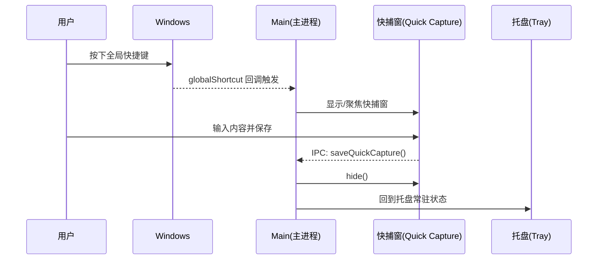

# 03. Windows 系统集成与窗口规格（托盘/快捷键/无边框/通知/迁移）

本文档定义 Windows 桌面端的系统集成规格（不含实现代码）。所有条款均应可验收。

## 0. 范围与前置约束

- MUST: 仅承诺 Windows 桌面端（Windows 10/11）；不得写入 macOS/Linux 的分支行为或承诺。
- MUST: 主窗口默认去掉原生标题栏（无边框 frameless），并提供可拖拽区域与可点击区域划分（依据：`AGENTS.md`）。
- MUST: 遵循 Electron 安全基线：renderer 不直接触达系统能力（托盘/快捷键/文件系统/更新/通知），必须通过 preload 暴露的“用例级 API”进入 main（依据：`DESIGN.md` 14.4.1/14.4.4）。
- MUST: 托盘菜单的“立即同步”在文案层区分两条链路：
  - `立即同步：笔记（Memos）`
  - `立即同步：结构与待办（Flow）`

## 1. 托盘常驻 + 右键菜单 IA（信息架构）

### 1.1 行为总则

- MUST: 应用存在“托盘常驻”模式：当所有窗口都关闭/隐藏时，进程仍保持运行，托盘图标仍可操作（参考：Electron Tray Menu 教程的“Minimizing to tray”段落）。
- MUST: `Tray` 对象必须由 main 进程创建，并在主进程持有强引用（全局变量/单例）防止被 GC 回收（参考：Electron Tray Menu 教程“save a reference to the Tray object globally to avoid garbage collection”）。
- MUST: 托盘图标资源在 Windows 下使用 `.ico` 以获得最佳显示效果（参考：Electron `Tray` API 文档 Windows 平台说明）。
- SHOULD: 若使用 `new Tray(image, guid)` 的 `guid` 参数：
  - MUST: `guid` 使用 UUID 格式。
  - SHOULD: 仅在可执行文件签名（code-signed）后启用，以避免路径变化导致托盘图标创建/关联异常（参考：Electron `Tray` API 中 Windows 关于 `guid` 的说明）。

### 1.2 Win11 托盘“溢出区”产品约束

- MUST: 产品与文档不得承诺“托盘图标永远可见”。
- MUST: 在 Win11 上，用户可能将图标放入“托盘溢出区”（隐藏图标），因此：
  - MUST: 所有关键操作必须可通过应用内入口（设置页）触达，不能把关键能力只放在托盘。
  - SHOULD: 首次启用托盘常驻时，提示用户可在 Windows 设置中将图标固定到任务栏通知区域（只提示，不保证）。

### 1.3 右键菜单 IA（必须包含的项）

托盘右键菜单必须至少包含以下条目，且顺序与分组可验收：

- MUST: `显示主窗口` / `隐藏主窗口`（同一位置动态切换）。
- MUST: `快速捕捉`（打开/聚焦 Quick Capture 快捕窗）。
- MUST: `立即同步：笔记（Memos）`。
- MUST: `立即同步：结构与待办（Flow）`。
- MUST: `打开设置`（直接打开设置页/聚焦设置窗口）。
- MUST: `退出`（唯一“真正退出进程”的入口，见第 2 章）。

可选但推荐：

- SHOULD: 菜单中显示“同步状态摘要”只读项（例如：`同步：空闲 / 同步中 / 失败`），用于快速诊断。
- SHOULD: 若存在未登录/未配置服务器等前置条件，相关条目应显示为 disabled，并在 tooltip 或点击时给出可操作提示。

### 1.4 点击/双击语义

- SHOULD: 单击托盘图标：显示/聚焦主窗口（若窗口已可见则聚焦；若隐藏则显示）。
- SHOULD: 右键托盘图标：弹出上述菜单。
- MUST NOT: 托盘交互不得触发不可逆行为（例如直接退出、直接删除数据）。

权威参考：

- Electron `Tray` API：https://www.electronjs.org/docs/latest/api/tray
- Electron Tray Menu 教程：https://www.electronjs.org/docs/latest/tutorial/tray

## 2. 关闭按钮语义（默认最小化到托盘；退出只能托盘菜单）

### 2.1 默认行为

- MUST: 主窗口点击关闭按钮（右上角 X）时，默认行为为“隐藏窗口并保留进程”，等价于“最小化到托盘”，不得退出应用（依据：根目录 `PLAN.md` 明确需求）。
- MUST: 当用户关闭最后一个窗口时，应用不得自动退出；`window-all-closed` 事件应被拦截以保持托盘常驻（参考：Electron Tray Menu 教程“Minimizing to tray”）。

### 2.2 退出路径（唯一）

- MUST: “真正退出”必须且只能通过托盘菜单 `退出` 触发。
- MUST: 退出时应执行清理动作（见 2.4），并确保不会残留全局快捷键注册。
- MUST NOT: 在主窗口内提供“退出应用”的等价按钮（允许提供“退出到托盘/隐藏窗口”的按钮，但不得真正退出）。

### 2.3 首次提示策略（可配置）

- MUST: 第一次用户点击关闭按钮时，必须出现一次解释性提示（轻提示/对话框/气泡均可），内容至少包含：
  - `关闭按钮将最小化到托盘，应用仍在后台运行。`
  - `要退出请在托盘右键菜单选择“退出”。`
- SHOULD: 提供 `不再提示` 选项。
- MUST: 在设置中提供可配置项：
  - `关闭按钮行为：最小化到托盘 / 退出应用`
- MUST: 若用户将其改为“退出应用”，仍应保留托盘入口（托盘常驻可作为开关单独控制），且必须明确告知该行为变化会影响后台同步与快捷键可用性。

### 2.4 退出清理（必须可验收）

- MUST: 退出时必须注销所有全局快捷键（`globalShortcut.unregisterAll()` 或等价逐一注销），避免应用退出后快捷键仍被占用。
- MUST: 退出时必须停止所有后台定时器/同步调度（避免出现“进程正在退出但仍发网络请求/写 DB”的竞态）。
- MUST: 退出时必须安全关闭本地数据库连接与文件句柄（DB/WAL/日志文件等）。
- SHOULD: 退出时销毁托盘对象并释放资源（例如 `tray.destroy()`），确保退出后托盘图标不残留。

## 3. 全局快捷键（GlobalShortcut）

### 3.1 注册时机与生命周期

- MUST: 全局快捷键仅由 main 进程注册与管理（renderer 只能通过 IPC 触发“请求注册/变更/禁用”意图）。
- MUST: `globalShortcut` 只能在 app ready 之后使用（参考：Electron `globalShortcut` 文档说明）。
- MUST: 应用退出（will-quit）时必须注销：
  - `globalShortcut.unregister(...)` 或 `globalShortcut.unregisterAll()`（参考：Electron `globalShortcut` 文档示例）。

### 3.2 冲突处理与 UX 退路

- MUST: 当 `globalShortcut.register(...)` 返回 `false` 时，必须视为注册失败，并提供明确 UX 退路：
  - MUST: 在设置页显示“当前快捷键不可用（被系统/其他应用占用）”。
  - SHOULD: 给出一键跳转到“修改快捷键”的入口。
- MUST: 必须在规格层明确：
  - `静默失败是操作系统的设计（OS 不希望应用争抢全局快捷键）`，因此不能以“未触发回调”作为唯一失败信号。
  - 依据：Electron `globalShortcut` 文档明确指出快捷键被其他应用占用时会 silently fail。

### 3.3 默认键位与可自定义

- SHOULD: 默认建议键位可沿用 `Alt+Space`（来自根目录 `PLAN.md` 的既定叙述），但必须允许用户自定义。
- MUST: 设置中必须支持：
  - 修改快捷键（以 accelerator 形式存储）。
  - 临时禁用快捷键。
  - 恢复默认值。
- MUST: 禁用策略：当“快速捕捉”功能被用户关闭时，必须自动注销快捷键；当再次启用时再注册。

### 3.4 快捕窗的焦点与回到托盘

- MUST: 快捷键触发后，必须打开/聚焦 Quick Capture 窗口；保存后窗口必须自动隐藏并回到“托盘常驻”状态。
- SHOULD: 快捕窗应支持 `Esc` 取消并隐藏（不保存），且不影响主窗口状态。

权威参考：

- Electron `globalShortcut` API：https://www.electronjs.org/docs/latest/api/global-shortcut

## 4. 无边框窗口（frameless）与可拖拽区域（app-region）

### 4.1 frameless 基线

- MUST: 主窗口使用无边框（`frame: false`）以去除 Windows 原生标题栏（依据：`AGENTS.md`）。
- MUST: 无边框窗口必须提供明确可拖拽区域，否则窗口无法移动。

权威参考：

- Electron 自定义窗口样式（Frameless windows）：https://www.electronjs.org/docs/latest/tutorial/custom-window-styles

### 4.2 app-region 规则（拖拽/可点击）

- MUST: 拖拽区域通过 CSS `app-region: drag` 标记（通常对应 `-webkit-app-region: drag` 的兼容写法）。
- MUST: 所有交互控件（按钮、输入框、下拉、标签页、可拖拽卡片等）必须在拖拽区域内显式标记为 `app-region: no-drag`，否则将无法接收指针事件。
- MUST: 在拖拽区域内必须禁用文本选择以避免拖拽与选中文本冲突（参考：Electron Custom Window Interactions 的“disable text selection”）。

权威参考：

- Electron 自定义窗口交互（Custom draggable regions / app-region）：https://www.electronjs.org/docs/latest/tutorial/custom-window-interactions

### 4.3 右键菜单与系统菜单约束

- MUST: 不得在拖拽区域内显示自定义右键菜单；在 Windows 上拖拽区域可能被视为 non-client frame，右键可能弹出系统菜单（参考：Electron Custom Window Interactions 的“disable context menus”提示）。
- SHOULD: 对内容区的右键菜单（笔记卡片、文件夹节点等）使用应用自定义菜单或 Electron 原生 Menu，但必须避开拖拽区域。

### 4.4 透明窗口限制（用于约束“毛玻璃”方案）

- MUST: 不得依赖 `transparent: true` 来实现“模糊桌面/其他应用内容”的效果；Electron 文档明确说明 CSS `blur()` 只能作用于窗口内 web contents，无法模糊窗口下方的系统内容。
- SHOULD: “毛玻璃”视觉应以应用内层叠（CSS backdrop-filter/半透明材质）实现。
- MUST: 若 Quick Capture 窗口使用 `transparent: true`（见根目录 `PLAN.md` 的示例），必须遵循 Electron 对透明窗口的限制（不可穿透透明区域、可能不支持 resize、DevTools 打开时不透明等）。

权威参考：

- Electron Custom Window Styles（Transparent windows limitations）：https://www.electronjs.org/docs/latest/tutorial/custom-window-styles

## 5. Windows 通知（Toast/Notification）+ 更新前置条件

### 5.1 通知能力与前置条件

- MUST: Windows 通知默认使用 main 进程的 Electron `Notification` API。
- MUST: 在 Windows 上要让通知可靠展示，应用必须具备 Start Menu shortcut，并设置 AppUserModelID（AUMID）及 ToastActivatorCLSID 等前置条件；开发态可能需要显式调用 `app.setAppUserModelId()`（参考：Electron Notifications 教程 Windows 段落）。
- MUST: 打包与发布时必须配置明确的 `appId`，并将其作为 Windows 的 AUMID 使用（electron-builder 文档说明 `appId` 会作为 Windows 的 Application User Model ID，且强烈建议显式设置；仅 NSIS 目标支持，Squirrel.Windows 不支持）。

权威参考：

- Electron Notifications 教程（Windows 前置条件）：https://www.electronjs.org/docs/latest/tutorial/notifications
- Electron `Notification` API：https://www.electronjs.org/docs/latest/api/notification
- electron-builder Common Configuration（`appId` = Windows AUMID，NSIS only）：https://www.electron.build/configuration

### 5.2 Quiet Time / 勿扰与失败降级

- MUST: 通知发送失败或被系统静默丢弃时，必须降级（至少一种）：
  - 降级 A：应用内通知中心（in-app banner/toast），在用户下次打开主窗口时可见。
  - 降级 B：托盘气泡（`tray.displayBalloon`）用于补充提示。
- SHOULD: 托盘气泡应支持尊重“Quiet Time”（勿扰）设置，避免强打扰（参考：Electron `Tray.displayBalloon` 的 `respectQuietTime` 选项）。

权威参考：

- Electron `Tray.displayBalloon`（Quiet Time 选项）：https://www.electronjs.org/docs/latest/api/tray

### 5.3 与“更新”能力的耦合约束

- MUST: “检查更新 / 下载完成 / 需要重启安装”等提示，如果使用系统通知，则必须满足 5.1 的 AUMID 前置条件；否则必须走 5.2 的降级通道。
- MUST: Windows 的自动更新采用 electron-builder 的 `electron-updater`（NSIS 目标）；规格层必须明确：
  - Squirrel.Windows 不支持 electron-builder 的简化自动更新方案。
  - 更新事件与下载进度应可被 UI 消费（设置页“检查更新”与托盘菜单可触达）。

权威参考：

- electron-builder Auto Update：https://www.electron.build/auto-update

## 6. 数据目录选择与迁移（DB/WAL/附件缓存/logs）

### 6.1 设置入口与授权

- MUST: 设置页必须提供“数据存储目录”字段与“更改目录”动作（依据：根目录 `PLAN.md`）。
- MUST: 目录选择必须由 main 进程通过系统对话框完成，并将结果以 IPC 返回 renderer（依据：`DESIGN.md` 14.4.4：导出/保存路径必须来自系统对话框授权）。

### 6.2 迁移范围（必须覆盖）

迁移必须至少覆盖以下数据资产（按实际存在与否迁移）：

- MUST: SQLite 主库文件（DB）。
- MUST: SQLite 的 WAL/SHM（若启用 WAL）。
- MUST: 附件持久缓存目录（attachments cache / offline cache）。
- MUST: 日志目录（logs）。

### 6.3 迁移流程与可验收要求

- MUST: 迁移前必须展示确认对话框，至少包含：
  - 旧路径、新路径。
  - 预计迁移范围（DB/附件/日志）。
  - 风险提示：迁移期间不要关闭电脑；迁移完成需要重启。
- MUST: 迁移应具备“失败回滚”能力：
  - 若任一关键资产迁移失败，必须保持旧目录仍可用（不得破坏旧目录结构）。
  - 失败时必须给出可操作提示（重试/打开旧目录/查看日志）。
- MUST: 迁移完成后必须提示用户重启应用；并提供“立即重启”按钮（实现层可用 `app.relaunch()`，此处仅定义规格）。
- SHOULD: 迁移完成后应在新目录生成一次性校验标记（例如 `migration.json`），记录迁移时间、版本、源/目标路径，便于排障。

### 6.4 运行中资源与锁

- MUST: 迁移执行时必须阻止并发写入（例如暂停同步、暂停 DB 写入），避免迁移中出现半写入状态。
- SHOULD: 若无法在不重启的情况下安全搬迁 DB/WAL，应采用“计划迁移”：
  - 先复制附件与非锁文件；
  - 将“DB 切换”延后到重启后第一启动时执行；
  - 仍需满足 6.3 的失败回滚。

## 7. 关键交互时序（mermaid）

## 8. 参考链接（权威来源清单）

- 托盘与菜单：
  - https://www.electronjs.org/docs/latest/api/tray
  - https://www.electronjs.org/docs/latest/tutorial/tray
- 全局快捷键：
  - https://www.electronjs.org/docs/latest/api/global-shortcut
- 无边框与拖拽区域：
  - https://www.electronjs.org/docs/latest/tutorial/custom-window-styles
  - https://www.electronjs.org/docs/latest/tutorial/custom-window-interactions
- 通知：
  - https://www.electronjs.org/docs/latest/tutorial/notifications
  - https://www.electronjs.org/docs/latest/api/notification
- 自动更新（Windows/NSIS）：
  - https://www.electron.build/auto-update
- electron-builder `appId`（Windows AUMID）：
  - https://www.electron.build/configuration
