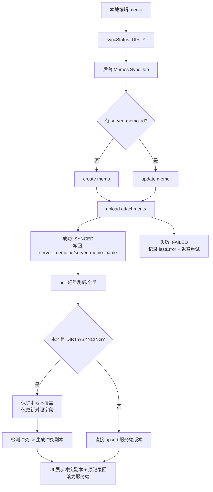
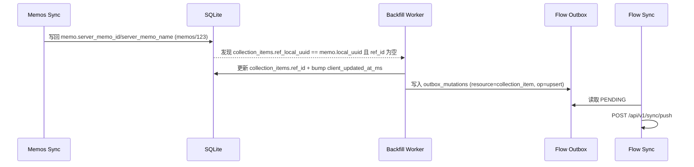

# 07. 同步算法与状态机规格（Flow Sync + Memos Sync + applied/rejected）

本章目标：把桌面端的同步实现写成“可直接照抄的规格”。

- 必须分为两条主干：Flow Sync（Todo/Collections/Settings/Notes）与 Memos Sync（memos/memo attachments）。
- Flow Sync 以 `/api/v1/sync/push`（applied/rejected）与 `/api/v1/sync/pull`（cursor/next_cursor/has_more）为唯一协议边界。
- Memos Sync 以 memo 的 `syncStatus` 状态机为核心，要求离线优先、可重试、不覆盖 DIRTY，并在冲突时生成“冲突副本”。
- 两条主干通过 Collections 的结构引用 backfill 联动：`ref_local_uuid -> ref_id`。

术语约定（本章强制口径）：

- outbox：本地 `outbox_mutations` 队列（见 `.sisyphus/drafts/plan-sections/05-local-data-model.md`）。
- cursor：Flow Sync 增量游标（整数）。
- applied / rejected：Flow Sync push 返回数组（见 `apidocs/api.zh-CN.md`）。
- server_snapshot：在线接口 409 的 `ErrorResponse.details.server_snapshot`（见 `apidocs/api.zh-CN.md`）。
- server（snapshot）：sync push 的 `rejected[].server`（见 `apidocs/api.zh-CN.md` 与 `apidocs/collections.zh-CN.md`）。

---

## 1) Flow Sync（Todo / Collections / Settings / Notes）

### 1.1 数据面：outbox 生成规则（写入即入队）

Flow Sync 覆盖资源（resource）：

- `todo_list` / `todo_item` / `todo_occurrence`
- `collection_item`
- `user_setting`
- `note`（即使桌面端主笔记走 Memos，也必须支持 Flow 的 notes 同步以保持协议完备与可 debug）

任何“会改变本地可见状态”的写操作，必须在同一事务内完成：

1) 业务表写入（含 `client_updated_at_ms` bump、`deleted_at` 变更等）
2) 写入 outbox（`channel="flow"`，`status="PENDING"`）

#### 1.1.1 哪些操作写入 outbox

- upsert：创建/编辑/重命名/改色/改排序/移动/归档/恢复（本质上都是对实体字段的 upsert）。
- delete：任何删除（软删除）必须写入一条 `op="delete"` 的 mutation。
- move/reorder：虽然在线接口建议走 move，但离线模式统一抽象为对 `collection_item` 或 `todo_*` 的 upsert（更新 `parent_id/sort_order/client_updated_at_ms`）。

#### 1.1.2 delete 的幂等语义（必须对齐服务端）

- 服务端约束：sync 的 delete 在服务端不存在时仍会视为成功（出现在 applied 中，见 `apidocs/api.zh-CN.md`）。
- 客户端约束：本地 delete 的 outbox 条目不得因为“本地已经 tombstone”而被跳过；它是多端一致删除的唯一证据。

#### 1.1.3 合并/去重策略（dedupe_key）

目标：减少 push 体积，同时保持语义正确。

- dedupe_key 建议：`flow:{resource}:{entity_id}`。
- 可合并：同一 `resource + entity_id` 的连续 `upsert`，可合并为最后一次 `upsert`（保留最新 `client_updated_at_ms` 与 data）。
- 不可合并：
  - `delete` 与其后的 `upsert` 不能简单覆盖（语义不同）。推荐策略：保留最后一次操作，但必须保证本地业务表的 tombstone/复活与 outbox 一致。
  - 不同资源之间不合并（例如 todo_item 与 todo_occurrence）。

#### 1.1.4 `client_updated_at_ms` bump（强制单调递增）

对同一实体 id，客户端必须保证 `client_updated_at_ms` 单调递增：

- 写入时取 `max(now_ms, last_ms + 1)`。
- 任何自动化写入（例如 backfill）也必须 bump（见第 3 章）。

---

### 1.2 push：批量、重试与 rejected 分类（applied/rejected 为准）

#### 1.2.1 推送窗口与批量大小

push 输入来源：`outbox_mutations` 中 `channel="flow" AND status in (PENDING, FAILED_RETRYABLE)` 且 `next_retry_at_ms <= now`。

建议批量：

- 每次 push 50~200 条 mutations（建议默认 100）。
- 若 payload 接近服务端限制或网络质量差，降低到 50；若本地积压很大，允许循环多轮。

#### 1.2.2 HTTP 失败与退避策略（含 429 Retry-After）

- 429 `rate_limited`：读取响应头 `Retry-After`（秒），将本轮剩余 outbox 的 `next_retry_at_ms` 推迟到 `now + retry_after*1000`，并停止继续 push（避免雪崩）。
- 5xx / `upstream_error` / 网络断开：指数退避 + 抖动（jitter），例如 `min(2^attempt * 5s, 5min) + rand(0..1s)`。
- 401 `unauthorized`：视为 fatal（停止自动重试，要求重新登录）。

#### 1.2.3 push 响应处理（applied / rejected）

服务端即使部分失败也会 HTTP 200，因此 push 的唯一成功标准是逐条处理 `applied[]/rejected[]`。

- applied：将对应 outbox 条目置为 `APPLIED`（或直接从 outbox 删除，取决于实现是否需要审计回放）。
- rejected：将 outbox 条目置为 `REJECTED_CONFLICT` 或 `FAILED_FATAL`（见下）。

#### 1.2.4 rejected 的分类与处理策略

`rejected[]` 结构（关键字段）：`resource/entity_id/reason/server`。

1) `reason="conflict"`（最重要）

- 必须把 `rejected[].server` 当作“服务端快照”写入本地（用于 UI 与后续 pull/apply 决策）。
- 推荐默认策略：server wins（避免覆盖服务端更晚版本导致抖动）。
  - 立即应用 server 快照到本地业务表（等价于先做一次“局部 pull apply”）。
  - outbox 标记 `REJECTED_CONFLICT`，并记录冲突元信息（resource/entity_id/server 快照/时间）。
- 若需要客户端胜出（特定资源可选）：
  - 必须先基于 server 快照做合并，再生成新的 upsert mutation，确保更大的 `client_updated_at_ms` 后重新入队。

2) 语义/校验类拒绝（例如 collections 文档提到的 `missing item_type` / `name is required`）

- 这类 rejected 不应无限重试：标记 `FAILED_FATAL`，并把错误原因暴露到 UI（提示用户手动修复或撤销本地改动）。

3) 未知 reason（容错）

- 保守策略：标记 `FAILED_RETRYABLE`（短退避 30~60s），同时记录原始 reason 供日志。

---

### 1.3 pull：cursor/next_cursor/has_more 与 changes 应用策略

pull 请求：`GET /api/v1/sync/pull?cursor=<local.cursor>&limit=<n>`。

#### 1.3.1 游标推进规则（必须可恢复、不可回退）

- 本地持久化 `sync_state(channel="flow")`：至少包含 `cursor/next_cursor/has_more/last_pull_at_ms/last_error`。
- 只有在“成功应用本次 changes 到本地事务提交”之后，才能把 `cursor` 推进到响应的 `next_cursor`。
- 若应用 changes 中途崩溃：下次仍从旧 cursor 重拉；因此 apply 必须幂等（见 1.3.3）。

#### 1.3.2 分页循环

- 当 `has_more=true`：继续用上次响应的 `next_cursor` 拉下一页，直到 `has_more=false`。
- 推荐每轮 pull 的 limit：200~500（服务端上限 1000，见 `apidocs/api.zh-CN.md`）。

#### 1.3.3 changes 的 upsert/tombstone 应用策略（幂等）

对 `changes.<resource_key>[]` 中的每个实体：

- 以服务端返回为准，按 `id` 做 upsert 覆盖本地同 id 行。
- 若 `deleted_at != null`：将本地标记 tombstone（UI 默认隐藏，但本地保留）。

幂等要求：

- 多次应用同一条 change 结果相同。
- 任何“本地派生字段”不得影响主字段；主字段总是服务端覆盖。

#### 1.3.4 `changes` key 容错（必须）

pull 的 `changes` 是一个 map，客户端必须对“未知 changes key”容错：

- 解析时遍历已知 key（todo_lists/todo_items/todo_occurrences/user_settings/notes/collection_items）。
- 对未知 key：忽略并记录日志，不得崩溃。

特别提醒：`collection_items` 的存在以 `apidocs/collections.zh-CN.md` 为准，即使 `apidocs/api.zh-CN.md` 的枚举未列出 `collection_item`。

---

### 1.4 UI 状态暴露（全局 + 资源级）

#### 1.4.1 全局同步状态（Flow）

Flow 同步状态用于 UI 顶部/侧边状态点显示，必须能表达四态：

- 空闲：无可 push 的 outbox，且 pull 不在进行。
- 同步中：正在执行 push 或 pull（任一）。
- 失败：存在 `FAILED_RETRYABLE/FAILED_FATAL`，且本轮同步已结束。
- 冲突待处理：存在 `REJECTED_CONFLICT` 或者拉取到的冲突标记需要用户决策。

#### 1.4.2 资源级/outbox 条目状态

每条 outbox 需要在 UI/调试页可见（用于“为什么没同步上去”）：

- `PENDING`：待发送
- `INFLIGHT`：本轮正在发送（可附 request_id）
- `APPLIED`：已应用（可清理）
- `REJECTED_CONFLICT`：被拒绝（conflict），需展示 `server` 快照或引导用户查看
- `FAILED_RETRYABLE`：可重试失败（含 `next_retry_at_ms` 与 `last_error`）
- `FAILED_FATAL`：不可重试（需要用户介入）

---

## 2) Memos Sync（Notes / Memos：memo + attachments）

Memos Sync 的“权威读取源”仍是本地 SQLite（离线优先）。同步的工作是：

- 把本地未同步的 memo/attachments 推送到 Memos（create/update/upload）。
- 把服务端的 memo 增量回拉到本地（轻量刷新或 full sync）。
- 任何时候都不能覆盖本地 `DIRTY` 的未同步编辑；发生冲突要生成“冲突副本”。

### 2.1 memo 的 syncStatus 状态机（LOCAL_ONLY/DIRTY/SYNCING/SYNCED/FAILED）

#### 2.1.1 状态定义

- `LOCAL_ONLY`：仅本地存在；尚未创建到服务端（无 `server_memo_id`）。
- `DIRTY`：本地已编辑，需要同步到服务端（可能有 `server_memo_id`）。
- `SYNCING`：同步进行中（仅表示后台正在处理该 memo，不代表已成功）。
- `SYNCED`：本地与服务端一致（就绪）。
- `FAILED`：上次同步失败；保留 `lastError` 供 UI 展示与重试。

#### 2.1.2 状态转移条件（强制）

- 任意本地编辑（正文/可见字段/附件变更）：
  - 若当前是 `SYNCING`：允许继续写（离线优先），但必须保持该 memo 仍被视为需要同步（最终落为 `DIRTY`）。
  - 其它状态：直接置为 `DIRTY`。

- 同步开始处理某条 memo：置为 `SYNCING`（用于 UI 反馈）。

- 同步成功：置为 `SYNCED`，清空 `lastError`，并把服务端返回的 `server_memo_id` / `server_memo_name` / `server_updated_at` 写回。

- 同步失败（网络/5xx/超时/上游错误）：置为 `FAILED` 并写入 `lastError`，同时生成/更新 outbox 重试信息。

### 2.2 outbox（Memos）与“保护 DIRTY 不被覆盖”规则

Memos 侧同样使用 outbox（`channel="memos"`），但其语义与 Flow 不同：

- entity_id 建议固定为 `memos.local_uuid`（避免把 `memos/123` 当作路径片段或本地 key）。
- resource 可用 `memo` 与 `memo_attachment` 两类。

#### 2.2.1 上传策略（create/update + attachments）

对每个需要同步的 memo（`LOCAL_ONLY/DIRTY/FAILED`）：

1) 若没有 `server_memo_id`：执行 create memo（成功后写回 `server_memo_id`，并可能得到 `server_memo_name`，例如 `memos/123`）。
2) 若已有 `server_memo_id`：执行 update memo（只提交变更字段）。
3) attachments：
   - 本地新增附件先上传（或先落库 metadata），成功后把 `remote_name` 写回。
   - 最终把附件引用绑定到 memo（与 Android 端一致：先保证附件上传成功，再把 attachment 引用集合写回 memo）。

失败重试：

- 网络/5xx：指数退避；保留 `attempt/next_retry_at_ms/lastError`。
- 语义/权限错误：标记为 `FAILED` 且视为不可自动重试（需要用户操作：登录/权限/附件过大等）。

#### 2.2.2 回拉合并规则（轻量刷新 vs full sync）

回拉分两种模式：

- 轻量刷新（默认）：最多拉固定页数（例如 4 页 * 50），用于频繁刷新列表。
- full sync（用户触发或需要修复时）：按服务端分页拉全量（NORMAL/ARCHIVED 分段可选），直到没有 nextPageToken。

合并规则（核心：不覆盖 DIRTY）：

- 若本地 memo 为 `DIRTY` 或 `SYNCING`：
  - 不允许用回拉结果覆盖正文与用户编辑字段。
  - 可以更新“只读对照字段”（例如 server_updated_at）用于冲突检测。
- 若本地 memo 为 `SYNCED/LOCAL_ONLY/FAILED` 且不存在本地未提交编辑：
  - 可以直接用服务端版本覆盖本地（upsert）。

### 2.3 冲突处理：生成“冲突副本”并回滚原记录（对齐 DESIGN.md）

冲突判定（原则）：当同一条服务端 memo（同一 `server_memo_id`）在本地编辑期间，服务端版本发生了更新，导致“本地编辑无法安全覆盖”。

处理策略（必须不丢内容）：

1) 生成冲突副本

- 新建一条本地 memo（新的 `local_uuid`），其内容为“本地未同步版本”的快照，并在开头插入冲突说明（包含：原 memo 标识、冲突发生时间、本地编辑时间、服务端更新时间）。
- 冲突副本的 `syncStatus` 初始置为 `DIRTY`（允许用户继续编辑并后续上传为新 memo）。
- 冲突副本的附件：
  - 仅携带本地附件引用；上传时按新 memo 重新上传/绑定，避免把旧 memo 的远端引用强行复用导致权限/引用错乱。

2) 回滚原记录为服务端版本

- 把服务端版本 upsert 回原 memo（覆盖正文与服务端字段）。
- 原 memo 的 `syncStatus` 置为 `SYNCED`（或依据本地是否还有其它未同步字段决定）。

3) UI 呈现

- 原 memo 保持“与云一致”；冲突副本在列表中可见，并以明确标记展示“冲突副本”。
- 用户可以：保留副本、手动合并后删除其中一条。

---

## 3) 联动点：结构引用 backfill（`ref_local_uuid -> ref_id`）

backfill 的存在原因：Collections 的 `note_ref` 在离线优先下可能先只有本地引用（`ref_local_uuid`），而服务端同步需要 `ref_id`。

### 3.1 backfill 触发时机（必须覆盖两类）

1) 本地 memo 上传成功后拿到服务端标识

- 条件：memo 从 `LOCAL_ONLY/DIRTY` 成功同步后，写回 `server_memo_id` 或 `server_memo_name`（例如 `memos/123`）。
- 动作：扫描 `collection_items` 中满足 `ref_local_uuid == memo.local_uuid AND (ref_id IS NULL OR ref_id == "")` 的记录，准备回填。

2) Flow pull 回来的 collection_items 只有 `ref_id`

- 条件：pull 的 `changes.collection_items[]`（或容错变体）里出现 `ref_type="memos_memo"` 且 `ref_id` 存在。
- 动作：若能在本地 memos 表用 `server_memo_id` 或 `server_memo_name` 命中，则写回 `ref_local_uuid`（让离线打开优先走本地）。

### 3.2 backfill 如何写入 Flow outbox（必须）

backfill 属于结构层元数据更新，必须进入 Flow outbox：

- `channel="flow"`
- `resource="collection_item"`
- `op="upsert"`
- `entity_id=<collection_item.id>`
- `data` 至少包含：`item_type/ref_type/ref_id/parent_id/name/color/sort_order`（与服务端 upsert 合同一致；缺失字段可能导致语义拒绝进入 rejected）。

并发约束：

- 必须 bump `client_updated_at_ms`：取 `max(now_ms, old_client_updated_at_ms + 1)`，避免 LWW 回退。
- backfill 的 outbox 生成必须与本地 `collection_items` 表更新在同一事务内提交。

### 3.3 UI 如何体现“引用未就绪/待回填”

当 `collection_items.item_type="note_ref"` 且 `ref_local_uuid` 可解析但 `ref_id` 为空时：

- UI 允许离线打开（按 `ref_local_uuid` 直接打开本地 memo）。
- 同时显示一个轻量状态点：引用待回填（表示结构同步尚未完整）。
- 该提示不应阻塞用户操作；backfill 成功后自动消失。

---

## 4) Mermaid：关键时序与数据流（实现对照图）

### 4.1 Flow：本地 outbox → /sync/push → /sync/pull → UI

```mermaid
flowchart LR
  UI[UI 写入本地表] --> TX[(同一事务\n业务表 + outbox_mutations)]
  TX --> OB[outbox: flow/PENDING]
  OB --> PUSH[POST /api/v1/sync/push\nmutations[]]
  PUSH -->|applied[]| A[标记 APPLIED / 删除 outbox]
  PUSH -->|rejected[]| R[标记 REJECTED_*\n保存 server 快照]
  A --> PULL[GET /api/v1/sync/pull\ncursor -> next_cursor]
  R --> PULL
  PULL --> APPLY[apply changes\nupsert + tombstone]
  APPLY --> UI2[UI 订阅本地 SQLite]
```

### 4.2 Memos：本地 memo → create/update → pull → UI（含冲突副本）



### 4.3 Backfill：serverId 生成 → 回填 ref_id → push collection_item



---

## 5) 失败与一致性保证（两条链路通用）

### 5.1 崩溃恢复与幂等

- outbox 是可回放源：只要事务提交成功，本地修改就不会丢；同步可在重启后继续。
- Flow pull 的 cursor 推进必须在 apply 成功后提交，避免漏应用。
- push 的 applied/rejected 必须逐条处理，禁止按“HTTP 200 即成功”。

### 5.2 冲突信息的统一抽象（server_snapshot 与 rejected[].server）

客户端内部应统一“冲突快照”结构：

- 在线接口：来自 `ErrorResponse.details.server_snapshot`（server_snapshot）。
- sync push：来自 `rejected[].server`（server）。

两者都必须：

- 持久化到本地（便于 UI、日志与后续决策）。
- 可被 UI 查询并展示（至少能看见 resource/entity_id/服务端 client_updated_at_ms）。
