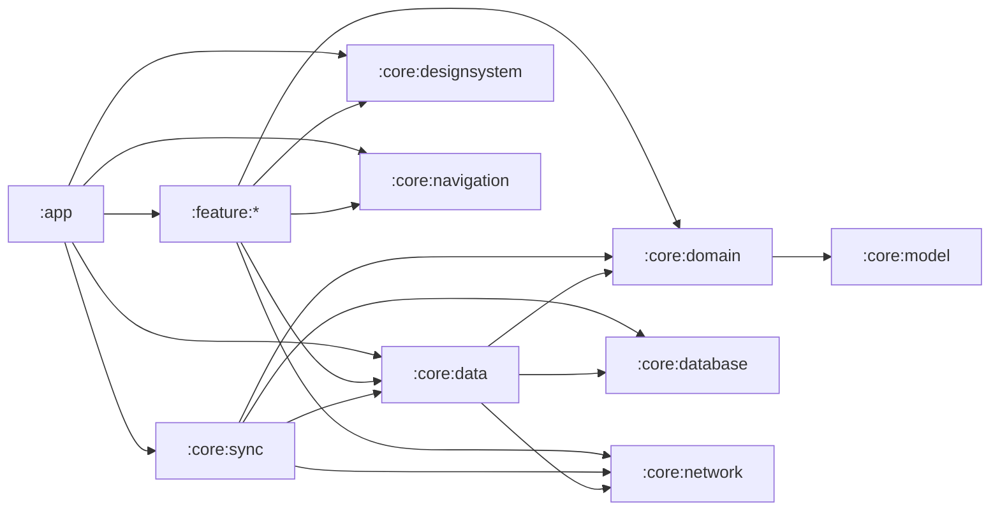
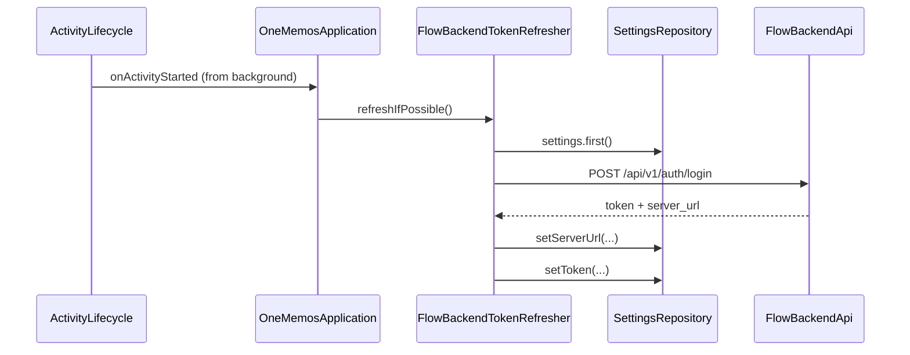
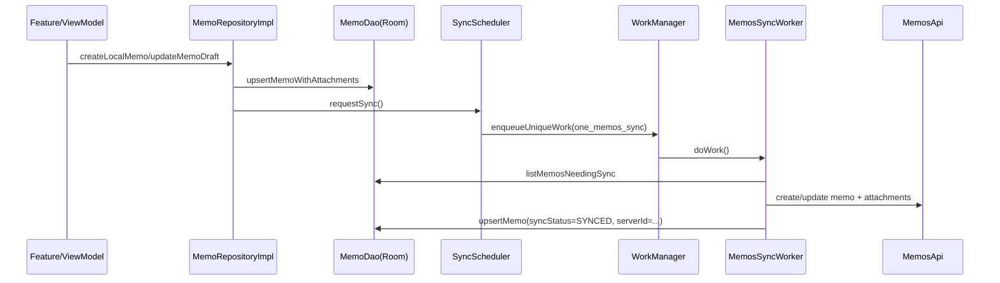

# xinliu 桌面端（Electron）前置：Android 端现状设计文档（1memos）

最后更新：2026-02-24

本文档把当前 `xinliu_android`（实际工程名：`1memos`）的设计与设计思路做一次“可追溯导出”，用于后续开发 `xinliu_desktop`（Electron）时：

- 不丢失已有架构边界与不变量（DB/路由/WorkManager 常量等）。
- 把 Android 的离线优先、同步、快速记录、墨迹卡片等关键体验迁移到桌面端时，有一套可以对照的分层与流程。

信息来源（仓库内证据）：

- `ARCHITECTURE.md`
- `项目总结.md`
- `to_app_plan.md`
- 关键源码（路径在各章节中给出）

---

## 1. 范围与非目标

范围（本次导出包含）：

- Android 端产品目标、核心体验与设计语言
- 多模块架构与依赖方向（core/feature/app）
- 离线优先数据模型（Memo/Attachment/Todo/Collections）
- 同步与后台任务（WorkManager：同步/预取/派生字段回填/提醒）
- 鉴权模式（Flow Backend 换取 memos token）
- 可测性与性能工程（benchmark/baselineprofile/macrobenchmark + scripts）
- Electron 桌面端承接建议（分层映射、存储/调度/安全）

非目标（本次不做）：

- 为 `xinliu_desktop` 直接落地代码或目录脚手架
- 重新设计全新的交互/视觉（只导出现状并给迁移建议）

---

## 2. 产品定位与设计原则

Android 端（1memos）的定位（见 `项目总结.md`）：

- 离线优先（Offline-first）：断网可浏览/新建/编辑，联网后自动同步。
- 极速记录：降低“打开 -> 记一条 -> 退出”的链路成本。
- 国风克制 UI：宣纸/墨色/印章风格，但不牺牲可读性与效率。
- 可维护可扩展：明确分层与边界，避免功能增长后失控。
- 性能可测/可防回归：baseline profile + macrobenchmark + benchmark 构建变体。

桌面端（Electron）建议继承的原则：

- 仍保持“离线优先 + 后台同步 + 明确边界”的结构，避免把逻辑堆在 UI（renderer）里。
- “印章式反馈”与“宣纸/墨色”可以保留为品牌资产，但交互要贴合桌面习惯（快捷键、右键菜单、拖拽）。

---

## 3. 技术栈与工程结构（Android 端）

### 3.1 技术栈（事实）

- UI：Jetpack Compose + Material3
- 导航：Navigation Compose（路由常量：`core/navigation/src/main/java/cc/pscly/onememos/ui/Routes.kt`）
- DI：Hilt（`@HiltAndroidApp` / `@AndroidEntryPoint` / `@HiltWorker`）
- 本地存储：Room（SQLite）
- 设置：DataStore（Preferences）+ 加密 Token（EncryptedSharedPreferences）
- 网络：Retrofit + OkHttp
- 后台：WorkManager（同步/预取/派生字段回填/Todo 提醒）
- 图片：Coil（Application 实现 `ImageLoaderFactory`）
- 二维码：ZXing（ShareCard）

### 3.2 Gradle 模块（事实）

工程模块在 `settings.gradle.kts`：

- `:app`（Composition Root）
- `:macrobenchmark`、`:baselineprofile`
- `:core:*`：`model/domain/database/network/data/sync/designsystem/navigation/performance`
- `:feature:*`：`home/collections/editor/settings/sharecard/quickcapture/profile/auth/welcome/start/todo`

---

## 4. 入口点与 Composition Root

### 4.1 Application / Activity

- Application：`app/src/main/java/cc/pscly/onememos/OneMemosApplication.kt`
  - 负责 WorkManager 初始化（`Configuration.Provider` + `HiltWorkerFactory`）
  - 负责 ImageLoader 配置（`ImageLoaderFactory`，磁盘/内存缓存策略）
  - 前台切换触发 Flow Backend token refresh（账号登录模式）
  - 启动后调度派生字段回填、Todo 提醒重排
- Launcher Activity：`app/src/main/java/cc/pscly/onememos/MainActivity.kt`
  - `setContent { OneMemosTheme { OneMemosApp(...) } }`
  - 支持外部启动参数：`EXTRA_START_EDITOR_UUID`、`EXTRA_START_ROUTE`

### 4.2 路由（Navigation Contracts）

路由常量与编码规则：`core/navigation/src/main/java/cc/pscly/onememos/ui/Routes.kt`

- `Routes.editor(uuid)` / `Routes.shareCard(uuid)` / `Routes.auth(mode)`
- 约束：uuid 可能包含 `/`（例如服务端资源名 `memos/123`），必须 `Uri.encode`。

该约束对桌面端很重要：

- 任何“以服务端资源名作 ID”的系统，URL/路由层都必须明确 encode/decode 规则。

### 4.3 功能清单（有哪些功能 + 怎么设计）

下面按“路由/模块”列出当前 Android 端已有的主要功能。每项包含：入口、核心设计、依赖接口（便于桌面端复刻）。

#### 4.3.1 欢迎与引导（Welcome）

- 路由：`Routes.WELCOME`（`welcome`）
- 模块：`feature/welcome`、`feature/start`
- 设计：首次安装/首次进入时展示引导；完成后写入 `SettingsRepository.setWelcomeCompleted(true)`，后续直接进入首页。
- 依赖接口：`SettingsRepository`

#### 4.3.2 登录/注册（Auth）

- 路由：`Routes.AUTH`（`auth?mode=...`）
- 模块：`feature/auth`
- 设计：
  - 使用 Flow Backend 账号体系（注册/登录），成功后拿到 `token + server_url`。
  - 写入设置：`SettingsRepository.setServerUrl(...)`、`SettingsRepository.setToken(...)`、`SettingsRepository.setLoginMode(LoginMode.BACKEND)`。
  - 写入后触发一次尽快同步：`SyncScheduler.requestSync()`。
  - 回到前台时会尝试自动刷新 token（只在 BACKEND 模式且本机保存了账号密码时执行）。
- 依赖接口：`SettingsRepository`、`SyncScheduler`
- 网络接口：`FlowBackendApi`

#### 4.3.3 笔记浏览（Home）与归档（Archived）

- 路由：`Routes.HOME`（`home`）、`Routes.ARCHIVED`（`archived`）
- 模块：`feature/home`
- 设计：
  - 列表采用 Paging 3：`MemoRepository.pagingMemos(...)` / `MemoRepository.pagingArchivedMemos(...)`，避免一次性加载大量 memos。
  - BrowseScope：`MemoRepository.BrowseScope` 提供 `All/Creator/LocalOnly`。
    - `LocalOnly` 用于“已登录但 creator 未解析”的保守模式：只显示本地未上传记录，避免误展示公开/工作区内容。
  - 预览字段：`plainPreview/tagsText` 由派生字段计算；后台会按需重建（`MemoDerivedFieldsRebuildWorker`）。
- 依赖接口：`MemoRepository`、`SyncScheduler`、`SyncStatusMonitor`
- 后台任务：`WorkManagerSyncScheduler`、`MemosSyncWorker`、`MemoDerivedFieldsRebuildScheduler`

#### 4.3.4 笔记编辑（Editor）

- 路由：`Routes.EDITOR`（`editor?uuid=...`）
- 模块：`feature/editor`
- 设计：编辑写入走 `MemoRepository.updateMemoDraft(...)` / `updateMemoContent(...)`；附件以 draft 形式更新；写入先落库再触发同步（离线优先）。
- 依赖接口：`MemoRepository`、`SettingsRepository`

#### 4.3.5 分享卡片（ShareCard）

- 路由：`Routes.SHARE_CARD`（`share_card?uuid=...`）
- 模块：`feature/sharecard`
- 设计：离屏渲染生成图片；落盘到 `cacheDir/share_cards/`；通过 FileProvider 分享（白名单在 `app/src/main/res/xml/file_paths.xml`）。
- 依赖接口：`MemoRepository`（读取 memo/附件）
- 关键类：
  - `feature/sharecard/src/main/java/cc/pscly/onememos/ui/feature/sharecard/ShareCardViewModel.kt`
  - `feature/sharecard/src/main/java/cc/pscly/onememos/ui/feature/sharecard/ShareCardBitmapRenderer.kt`
  - `feature/sharecard/src/main/java/cc/pscly/onememos/ui/feature/sharecard/ShareCardFileStore.kt`

#### 4.3.6 快速记录（QuickCapture，含悬浮窗）

- 入口：设置开关启用悬浮窗；悬浮窗服务 `app/src/main/java/cc/pscly/onememos/overlay/QuickCaptureOverlayService.kt`；同时也有 `feature/quickcapture` 的完整页面。
- 模块：`feature/quickcapture` + `app/overlay`
- 设计：
  - 草稿：写入 `noBackupFilesDir/quick_capture_draft/draft.json`（原子写 tmp + rename）。
  - 草稿附件：复制到 `filesDir/quick_capture_draft_attachments/`，避免依赖外部 Uri 的生命周期。
  - 提交：调用 `MemoRepository.createLocalMemo(...)` / `updateLocalMemo(...)`，先落库后同步。
- 依赖接口：`SettingsRepository`（悬浮窗开关）、`MemoRepository`
- 关键类：`feature/quickcapture/src/main/java/cc/pscly/onememos/ui/feature/quickcapture/draft/QuickCaptureDraftStore.kt`

#### 4.3.7 锦囊/收藏夹（Collections）

- 路由：`Routes.COLLECTIONS`（`collections`）
- 模块：`feature/collections`
- 设计：
  - 树形结构（Folder + MemoRef）。
  - 对 memo 引用支持双轨：`refLocalUuid`（本地 uuid）与 `refId`（服务端 id）。
  - 当 memo 同步后拿到 `serverId`，可通过 `CollectionsRepository.backfillMemoRefId(...)` 回填引用。
- 同步：Collections 与 Todo 同走 Flow Sync（outbox + cursor），由 `FlowTodoSyncWorker` 统一 push/pull。
- 依赖接口：`CollectionsRepository`、`TodoSyncScheduler`

#### 4.3.8 待办（Todo）与提醒/日历联动

- 路由：`Routes.TODO`（`todo`）
- 模块：`feature/todo`
- 设计：
  - 本地优先：UI 只订阅本地 Room；写操作先落库。
  - 写入同步意图：写操作写入 outbox；后台 `FlowTodoSyncWorker` 做 push/pull。
  - 提醒重排：`TodoReminderRescheduleWorker` 扫描 `TodoItem.remindersJson`，计算未来触发点并排程通知。
    - SMART：WorkManager 延时 notify
    - EXACT：AlarmManager（需系统能力支持），并维护 DataStore 状态
  - 日历联动：可选把 Todo 写入系统日历（READ/WRITE_CALENDAR 权限）。
- 依赖接口：`TodoRepository`、`TodoSyncScheduler`、`TodoReminderScheduler`、`TodoReminderTestScheduler`
- 网络接口：`FlowSyncApi`

#### 4.3.9 个人页（Profile）

- 路由：`Routes.PROFILE`（`profile`）
- 模块：`feature/profile`
- 设计：按时间范围加载 memo：`MemoRepository.observeMemosByCreatedAtRange(...)`，用于统计/洞察，避免订阅全量数据。
- 依赖接口：`MemoRepository`

#### 4.3.10 设置（Settings）

- 路由：`Routes.SETTINGS`（`settings`）
- 模块：`feature/settings`
- 设计：集中管理 server/token、主题、缓存/预取、上传阈值、快速记录开关、提醒模式、日历联动；提供运维入口（立即同步/全量重同步/重建派生字段）。
- 依赖接口：`SettingsRepository`、`SyncScheduler`、`TodoReminderScheduler`、`CacheRepository`

---

## 5. 架构分层与依赖方向（核心设计思路）

本工程采用“领域接口在 core/domain，数据与基础设施实现放在 core/data/core/*，UI 在 feature/*，组合根在 app”的结构。

### 5.1 分层概览

- `core/model`：纯数据结构（领域模型）
- `core/domain`：接口与纯逻辑（Repository 接口、派生字段计算、标签解析、同步调度接口等）
- `core/database`：Room 表/Dao/关系模型
- `core/network`：Retrofit API、URL 拼接、DTO
- `core/data`：Repository 实现（“先落库 + 触发同步”）、Settings/Cache/Auth storage 等
- `core/sync`：WorkManager Worker + 调度器（domain sync 接口的实现）
- `core/designsystem`：主题/组件（InkCard/SealButton/Markdown 相关复用）
- `feature/*`：每个业务功能的 UI/VM
- `app`：唯一 Composition Root（NavHost、DI 装配、Android 入口点）

### 5.2 依赖方向（推荐/事实一致）



设计收益（迁移到 Electron 时同样适用）：

- UI/交互层可以快速迭代，但不会把同步/存储/安全逻辑散落在各处。
- Worker/后台任务的常量与不变量有统一归属（避免“字符串漂移”）。

### 5.3 关键接口清单（有哪些接口）

这里列出 Android 端对上层（feature/app）最重要的“稳定接口”（以 `core/domain` 为准）。桌面端建议优先对齐这些接口，再在 `main` 层实现对应的存储/网络/后台调度适配器。

#### 5.3.1 Repository（领域仓库接口）

- MemoRepository：`core/domain/src/main/java/cc/pscly/onememos/domain/repository/MemoRepository.kt`
  - 设计要点：
    - `BrowseScope.All/Creator/LocalOnly`：creator 未解析时只展示本地未上传记录（保守策略）。
    - 首页/归档页使用 Paging：`pagingMemos(...)` / `pagingArchivedMemos(...)`。
  - 核心方法：`getMemo/createLocalMemo/updateLocalMemo/updateMemoDraft/archiveMemo/unarchiveMemo`。
- TodoRepository：`core/domain/src/main/java/cc/pscly/onememos/domain/repository/TodoRepository.kt`
  - 设计要点：本地优先 + outbox 同步（实现层写 outbox，Worker push/pull）。
  - 核心方法：`observeLists/observeItems/createItem/updateItem/setItemDone/observeOccurrences/completeNextOccurrence`。
- CollectionsRepository：`core/domain/src/main/java/cc/pscly/onememos/domain/repository/CollectionsRepository.kt`
  - 设计要点：树形结构；memo 引用双轨（local uuid + server refId），提供 `backfillMemoRefId` 回填。
  - 核心方法：`observeChildren/createFolder/addMemoRef/move/reorder/batchDelete/backfillMemoRefId`。
- SettingsRepository：`core/domain/src/main/java/cc/pscly/onememos/domain/repository/SettingsRepository.kt`
  - 设计要点：所有“运行开关/阈值/模式”（主题、预取、上传阈值、提醒、日历联动、developer options、同步状态）统一从此读取/写入。
  - 核心方法：`setServerUrl/setToken/setLoginMode/setThemePalette/setOfflineImagePrefetchEnabled/setTodoReminderMode/...`。
- CacheRepository：`core/domain/src/main/java/cc/pscly/onememos/domain/repository/CacheRepository.kt`
  - 设计要点：附件缓存是“持久缓存”（写回 attachment.cacheUri），用于离线秒开与预取。
  - 核心方法：`getCacheStats/clearAttachmentCache/ensureImageAttachmentCached`。

#### 5.3.2 同步调度与状态（领域接口）

- SyncScheduler：`core/domain/src/main/java/cc/pscly/onememos/domain/sync/SyncScheduler.kt`
  - 用途：触发 memo 的一次尽快同步；以及用户手动的 full resync。
- SyncStatusMonitor：`core/domain/src/main/java/cc/pscly/onememos/domain/sync/SyncStatusMonitor.kt`
  - 用途：对 UI 暴露全局同步状态（WorkManager/网络/待同步数量等聚合后输出）。
- TodoSyncScheduler：`core/domain/src/main/java/cc/pscly/onememos/domain/sync/TodoSyncScheduler.kt`
  - 用途：触发一次 Todo/Collections 的尽快同步（push outbox + pull changes）。
- TodoReminderScheduler：`core/domain/src/main/java/cc/pscly/onememos/domain/sync/TodoReminderScheduler.kt`
  - 用途：触发一次“尽快重排提醒”。
- TodoReminderTestScheduler：`core/domain/src/main/java/cc/pscly/onememos/domain/sync/TodoReminderTestScheduler.kt`
  - 用途：测试提醒链路（权限/通道/调度是否可用），不依赖扫描逻辑。

#### 5.3.3 辅助接口（owner 分区）

- OwnerKeyProvider：`core/domain/src/main/java/cc/pscly/onememos/domain/util/OwnerKeyProvider.kt`
  - 用途：Todo/Collections 侧按 owner 分区（例如 outbox/sync_state/collection_items）。

---

## 6. 核心数据模型（离线优先）

### 6.1 Memo / Attachment

模型：

- `core/model/src/main/java/cc/pscly/onememos/domain/model/Memo.kt`：`uuid`、`serverId`、`creator`、`content`、`plainPreview`、`tags`、`syncStatus`、`attachments`...
- `core/model/src/main/java/cc/pscly/onememos/domain/model/MemoAttachment.kt`：`localUri/cacheUri/remoteName/filename/mimeType`...
- `core/model/src/main/java/cc/pscly/onememos/domain/model/SyncStatus.kt`：`LOCAL_ONLY/DIRTY/SYNCING/SYNCED/FAILED`

离线优先关键点（代码证据）：

- Room 主键是 `localId`（自增），`uuid` 仍保持业务唯一（`MemoEntity` 的 unique index）。
  - `core/database/src/main/java/cc/pscly/onememos/core/database/entity/MemoEntity.kt`
- 附件表通过外键引用 `memos.uuid`，因此 `uuid` 必须稳定。
  - `core/database/src/main/java/cc/pscly/onememos/core/database/entity/MemoAttachmentEntity.kt`

### 6.2 Settings（server/token 与运行开关）

- `core/model/src/main/java/cc/pscly/onememos/domain/model/AppSettings.kt`
  - `serverUrl/token/loginMode/currentUserCreator`
  - 离线缓存与预取：`offlineImagePrefetchEnabled/maxMemos/maxImages/attachmentCacheMaxMb`
  - 上传阈值：`attachmentUploadMaxMb`
  - Todo 提醒：`todoReminderMode`、日历联动相关字段
  - 轻量同步状态：`lastSync`、全量同步状态：`fullSync`
  - 开发者选项：自动标签元数据行隐藏、主页富预览粘住上限等

### 6.3 Collections（锦囊）

- `core/model/src/main/java/cc/pscly/onememos/domain/model/CollectionItem.kt`
  - `NOTE_REF` 采用双轨引用：`refId`（服务端 id）/ `refLocalUuid`（本地 uuid）
  - `localOnly` 表示未同步

### 6.4 Todo（待办）

- `core/model/src/main/java/cc/pscly/onememos/domain/model/TodoList.kt` / `TodoItem.kt` / `TodoOccurrence.kt`
- Todo 的 reminders 以 `remindersJson: String` 保持动态结构在 domain/UI 之外。
- 循环任务通过 `rrule/dtstartLocal/tzid` 表达，occurrence 用 `recurrenceIdLocal` 去重。

---

## 7. 本地存储与落盘（Android 端）

### 7.1 Room（SQLite）

数据库：

- DB：`core/database/src/main/java/cc/pscly/onememos/core/database/OneMemosDatabase.kt`
- DB 文件名（不可变约束）：`one_memos.db`（由 `app/src/main/java/cc/pscly/onememos/di/AppModule.kt` 提供）

当前 DB 版本（以代码为准）：`OneMemosDatabase.version = 11`。

迁移注册（以代码为准）：`AppModule.provideDatabase()` 显式注册 `MIGRATION_3_4 ... MIGRATION_10_11`。

关键表：

- `memos`：`MemoEntity`（`localId` 主键，`uuid` 唯一，`serverId` 用于回拉对齐）
  - `core/database/src/main/java/cc/pscly/onememos/core/database/entity/MemoEntity.kt`
- `memo_attachments`：`MemoAttachmentEntity`（外键到 `memos.uuid`，含 `cacheUri`）
  - `core/database/src/main/java/cc/pscly/onememos/core/database/entity/MemoAttachmentEntity.kt`
- `collection_items`：`CollectionItemEntity`（按 `ownerKey` 分区 + tombstone 字段）
  - `core/database/src/main/java/cc/pscly/onememos/core/database/entity/CollectionItemEntity.kt`
- `todo_*`：`TodoListEntity/TodoItemEntity/TodoOccurrenceEntity` + `todo_sync_outbox/todo_sync_state`
  - `core/database/src/main/java/cc/pscly/onememos/core/database/entity/*.kt`

重要约束（避免数据丢失）：

- 对 memos 的 upsert **禁止**使用 `OnConflictStrategy.REPLACE`（会触发删除再插入，导致外键级联删除附件）。
  - `core/database/src/main/java/cc/pscly/onememos/core/database/dao/MemoDao.kt` 的 `upsertMemo()` 注释与实现

### 7.2 Settings（DataStore + 加密 Token）

- Settings Flow：`SettingsRepository.settings: Flow<AppSettings>`
  - 接口：`core/domain/src/main/java/cc/pscly/onememos/domain/repository/SettingsRepository.kt`
  - 实现：`core/data/src/main/java/cc/pscly/onememos/data/settings/SettingsRepositoryImpl.kt`
- Token 加密落盘：`EncryptedTokenStorage`（EncryptedSharedPreferences，文件名 `one_memos_secure`）
  - `core/data/src/main/java/cc/pscly/onememos/data/settings/EncryptedTokenStorage.kt`

### 7.3 文件目录（缓存/导出/草稿）

- 图片/附件持久缓存：`filesDir/one_memos_attachment_cache`（由 CacheRepository/Prefetch 使用）
- ShareCard 导出缓存：`cacheDir/share_cards/`（通过 FileProvider 分享）
- QuickCapture 草稿：`noBackupFilesDir/quick_capture_draft/draft.json`（原子写 tmp + rename）
- QuickCapture 草稿附件：`filesDir/quick_capture_draft_attachments/`

---

## 8. 网络边界（Android 端）

### 8.1 Flow Backend（账号登录/注册）

对接规范：`to_app_plan.md`（原则：App 只向 Backend 换 `token + server_url`，拿到后直连 Memos）。

Retrofit API：`core/network/src/main/java/cc/pscly/onememos/core/network/FlowBackendApi.kt`

- `POST /api/v1/auth/register`
- `POST /api/v1/auth/login`

### 8.2 Memos Server（笔记主数据）

Retrofit API：`core/network/src/main/java/cc/pscly/onememos/core/network/MemosApi.kt`

- memo 的 create/update/attachments 等
- `authStatus` / `currentUser` 用于解析 `currentUserCreator`（“默认只看自己”的过滤基础）

URL 规则：`core/network/src/main/java/cc/pscly/onememos/core/network/MemosUrls.kt`

- `memoName` 可能是 `memos/123`，直接拼到 `api/v1/$memoName`（因此路由/编码必须谨慎）。

### 8.3 Flow Sync（Todo/Collections 的离线同步）

Retrofit API：`core/network/src/main/java/cc/pscly/onememos/core/network/FlowSyncApi.kt`

- `GET /api/v1/sync/pull?cursor&limit`
- `POST /api/v1/sync/push`

### 8.4 网络接口（HTTP API 列表）

本节把“有哪些接口”写成可直接对照实现的清单（以 Retrofit 接口定义为准）。

#### 8.4.1 Flow Backend（账号体系）

- Retrofit 接口：`core/network/src/main/java/cc/pscly/onememos/core/network/FlowBackendApi.kt`
- `POST /api/v1/auth/register`
  - Request：`FlowAuthRequest { username, password }`
  - Response：`FlowAuthResponse`（兼容扁平与 envelope 两种形态；字段可能出现在 `token/server_url` 或 `data.token/data.server_url`）
- `POST /api/v1/auth/login`
  - Request：`FlowAuthRequest { username, password }`
  - Response：`FlowAuthResponse`
- `POST /api/v1/me/password`
  - Header：`Authorization: Bearer <token>`
  - Request：`ChangePasswordRequest { current_password, new_password, new_password2 }`
  - Response：`FlowChangePasswordResponse`（同样兼容扁平与 envelope）

#### 8.4.2 Memos Server（笔记主数据）

- Retrofit 接口：`core/network/src/main/java/cc/pscly/onememos/core/network/MemosApi.kt`
- URL 构造与归一化：`core/network/src/main/java/cc/pscly/onememos/core/network/MemosUrls.kt`
  - `normalizeServerBase(raw)`：归一化 serverUrl（补 scheme、去掉尾部 `/`）
  - `memo(base, memoName)` / `memoAttachments(base, memoName)`：注意 `memoName` 可能是 `memos/123`
- `GET auth/status`（动态 URL）
  - `authStatus(@Url url)`：用于解析 `currentUserCreator`
- `GET users/me`（动态 URL）
  - `currentUser(@Url url)`：用于解析 `currentUserCreator`
- `GET memos`（动态 URL）
  - `listMemos(@Url url, pageSize, pageToken, state, orderBy, filter, showDeleted)`
- `GET memo`（动态 URL）
  - `getMemo(@Url url)`
- `POST memos`（动态 URL）
  - `createMemo(@Url url, @Body CreateMemoRequestDto)`
- `PATCH memo`（动态 URL）
  - `updateMemo(@Url url, updateMask, @Body UpdateMemoRequestDto)`
- `PATCH memo/attachments`（动态 URL）
  - `setMemoAttachments(@Url url, @Body SetMemoAttachmentsRequestDto)`
- `POST attachments`（动态 URL）
  - `createAttachment(@Url url, @Body CreateAttachmentRequestDto)`
  - `createAttachmentRaw(@Url url, @Body RequestBody)`（用于非图片等 raw 上传）

#### 8.4.3 Flow Sync v1（Todo/Collections 增量同步）

- Retrofit 接口：`core/network/src/main/java/cc/pscly/onememos/core/network/FlowSyncApi.kt`
- `GET /api/v1/sync/pull`
  - Header：`Authorization: Bearer <token>`
  - Query：`cursor`（默认 0）、`limit`（默认 200）
  - Header：`X-Request-Id`（可选，用于端到端追踪）
  - Response：`FlowSyncPullResponse { cursor, next_cursor, has_more, changes }`
- `POST /api/v1/sync/push`
  - Header：`Authorization: Bearer <token>`
  - Body：`FlowSyncPushRequest { mutations: List<FlowSyncMutation> }`
  - Header：`X-Request-Id`（可选）
  - Response：`FlowSyncPushResponse { cursor, applied?, rejected? }`

---

## 9. 同步与后台任务（WorkManager 体系）

核心思路：

- 领域层只暴露“意图接口”（`SyncScheduler/TodoSyncScheduler/TodoReminderScheduler`），实现细节放在 `core/sync`。
- 业务写操作在 RepositoryImpl 内“先落库 + requestSync”，同步统一由 Worker 执行（降低 UI 复杂度）。

### 9.1 domain 接口与 Hilt 绑定

- 接口：`core/domain/src/main/java/cc/pscly/onememos/domain/sync/*.kt`
- 绑定：`app/src/main/java/cc/pscly/onememos/di/WorkerModule.kt`
  - `SyncScheduler` -> `WorkManagerSyncScheduler`
  - `TodoSyncScheduler` -> `WorkManagerTodoSyncScheduler`
  - `TodoReminderScheduler` -> `WorkManagerTodoReminderScheduler`
  - `TodoReminderTestScheduler` -> `WorkManagerTodoReminderTestScheduler`
  - `SyncStatusMonitor` -> `WorkManagerSyncStatusMonitor`

### 9.2 Work 名称/Tag/InputKey（不可变约束的一部分）

Memo 同步：

- UniqueWorkName：`one_memos_sync`（`MemosSyncWorker.UNIQUE_WORK_NAME`）
- Tag：`one_memos_sync`（`MemosSyncWorker.TAG`）
- InputKey：
  - `force_full_sync`（全量同步）
  - `is_periodic`（周期同步）
  - `followup_sync`（补跑同步）

周期刷新：

- UniquePeriodicWorkName：`one_memos_periodic_sync`（`WorkManagerSyncScheduler` 内部常量）

附件预取：

- UniqueWorkName/Tag：`one_memos_attachment_prefetch`（`AttachmentPrefetchWorker`）

派生字段回填：

- UniqueWorkName/Tag：`one_memos_rebuild_memo_derived_fields`（`MemoDerivedFieldsRebuildWorker`）

Todo 同步：

- UniqueWorkName/Tag：`one_memos_flow_todo_sync`（`FlowTodoSyncWorker`）

Todo 提醒：

- Reschedule：`todo_reminder_reschedule_periodic` / `todo_reminder_reschedule_once`
- Notify：Tag `todo_reminder_notify`，UniqueWorkName `todo_reminder_notify:$itemId:$triggerAtMs:$minutes`
- Notify InputKey：`itemId/dueAtLocal/beforeMinutes`

（证据文件：`core/sync/src/main/java/cc/pscly/onememos/worker/*.kt`）

### 9.3 Memo 同步 Worker（高层流程）

同步调度：`core/sync/src/main/java/cc/pscly/onememos/worker/WorkManagerSyncScheduler.kt`

- `requestSync()`：enqueue `one_memos_sync`（KEEP）+ 确保启用 6 小时周期刷新
- `requestFullResync()`：enqueue `one_memos_sync`（REPLACE + `force_full_sync=true`）

Worker：`core/sync/src/main/java/cc/pscly/onememos/worker/MemosSyncWorker.kt`

- 前置：读取 settings；校验 serverBase/token；解析 inputData
- 上传：遍历 `MemoDao.listMemosNeedingSync()`
  - 先置 `SYNCING`（UI 反馈）
  - 无 `serverId`：create memo，成功后回写 `serverId`
  - 有 `serverId`：必要时做冲突处理，再 update
  - 附件：上传/绑定附件引用
  - 成功置 `SYNCED`，失败记录 `lastSyncError`
- 回拉：
  - 非 full：轻量刷新（最多 4 页 * 50）
  - full：`performFullSync`（NORMAL/ARCHIVED 两段，500/page，保护 dirty 不覆盖）
- 后置：触发附件预取；必要时 enqueue followup（避免 KEEP 吞掉同步意图）

### 9.4 附件预取

`core/sync/src/main/java/cc/pscly/onememos/worker/AttachmentPrefetchWorker.kt`

- 仅当 `offlineImagePrefetchEnabled=true` 且 server/token 有效
- 最近 N 条 memos（`offlineImagePrefetchMaxMemos`）中，预取最多 M 张图片（`offlineImagePrefetchMaxImages`）
- 缓存目录大小上限：`attachmentCacheMaxMb`
- 预取失败不影响主同步（直接 success）

### 9.5 派生字段回填

调度：`core/sync/src/main/java/cc/pscly/onememos/worker/MemoDerivedFieldsRebuildScheduler.kt`

- OneMemosApplication 启动后延迟触发一次
- Settings 提供“立即重建”按钮（REPLACE）

Worker：`core/sync/src/main/java/cc/pscly/onememos/worker/MemoDerivedFieldsRebuildWorker.kt`

- 批处理扫描 `derivedVersion < CURRENT_VERSION` 的 memo
- 重新 derive 并写回 `plainPreview/tagsText/derivedVersion/derivedAt`

### 9.6 Todo/Collections 同步（outbox + FlowSyncApi）

调度：`core/sync/src/main/java/cc/pscly/onememos/worker/WorkManagerTodoSyncScheduler.kt`

Worker：`core/sync/src/main/java/cc/pscly/onememos/worker/FlowTodoSyncWorker.kt`

- push：读取 `todo_sync_outbox`（PENDING），组装 `FlowSyncMutation` 推送；applied 删 outbox；rejected 处理冲突
- pull：按 cursor 增量拉取 changes（todo_lists/items/occurrences/collection_items）并写回本地
- 成功后触发一次 `TodoReminderScheduler.requestReschedule()`（保证提醒最终一致）

### 9.7 Todo 提醒（重排 + 通知）

- 调度器：`core/sync/src/main/java/cc/pscly/onememos/worker/WorkManagerTodoReminderScheduler.kt`
  - 周期兜底 + 立即重排
- Reschedule Worker：`core/sync/src/main/java/cc/pscly/onememos/worker/TodoReminderRescheduleWorker.kt`
  - 先清理历史 notify work
  - 计算未来触发点（lookahead）
  - SMART：WorkManager 延时 notify
  - EXACT：AlarmManager（需要精确闹钟能力），并维护 DataStore 状态
- Notify Worker：`core/sync/src/main/java/cc/pscly/onememos/worker/TodoReminderNotifyWorker.kt`
  - 到点读最新 item，已完成/删除则不通知

### 9.8 冲突处理策略（Memo / Todo / Collections）

目标：离线优先下允许多端并发编辑；发生冲突时不丢数据，并尽量保持“最终一致”。

- Memo（`core/sync/src/main/java/cc/pscly/onememos/worker/MemosSyncWorker.kt`）：
  - 冲突判定：同一条 memo（同一 `serverId`），服务端 `updatedAt` 晚于本地 `updatedAt`。
  - 策略：
    1) 把本地改动保存为“冲突副本”（新建一条本地 memo，content 前置冲突头：原记录 id、本地编辑时间、服务器更新时间；附件只携带本地附件并强制重新上传）。
    2) 尽量在本轮同步中直接把冲突副本上传到服务端并绑定附件；若失败则标记 FAILED 但副本仍保留在本地。
    3) 将原记录回滚为服务端版本（upsert remote -> local），避免覆盖服务端。
- Todo（`core/sync/src/main/java/cc/pscly/onememos/worker/FlowTodoSyncWorker.kt`）：
  - 当 push 被服务端以 `conflict` 拒绝且带 `server` 快照时：
    - 对 `todo_list/todo_item/todo_occurrence`：直接应用 server snapshot（server wins），并把 outbox 标记为 `REJECTED_CONFLICT`。
- Collections（同样在 `FlowTodoSyncWorker`）：
  - 当 collection item push 冲突：
    1) 把 server snapshot 保存为一个新的“冲突副本”条目（新 id + 名称追加 `_冲突_<suffix>`，并标记 `localOnly=true`）。
    2) 对本地原条目 bump `clientUpdatedAtMs`（保证比服务端更大），重新写入 outbox（UPsert），让下一次 push 以“更晚时间”覆盖服务端。

---

## 10. 关键业务流（设计思路 + 证据入口）

### 10.1 认证（账号登录 / token 刷新）

目标：普通用户“无感配置 serverUrl”，只要账号密码即可使用；token 失效/刷新不阻塞 UI。

关键实现：

- 前台切换触发刷新：`app/src/main/java/cc/pscly/onememos/OneMemosApplication.kt`
- 刷新逻辑：`core/data/src/main/java/cc/pscly/onememos/data/auth/FlowBackendTokenRefresher.kt`
  - 仅 `LoginMode.BACKEND` 且本机保存过账号密码才会刷新
  - dev2 未解锁时强制使用默认 memos server（`MemosUrls.DEFAULT_MEMOS_SERVER_URL`）

### 10.2 QuickCapture（极速记录 / 悬浮窗 / 草稿）

目标：让记录“更像拍一下印章”，降低上下文切换成本；并用草稿保证意外退出不丢。

关键实现：

- 草稿存储：`feature/quickcapture/src/main/java/cc/pscly/onememos/ui/feature/quickcapture/draft/QuickCaptureDraftStore.kt`
  - `noBackupFilesDir/quick_capture_draft/draft.json`（原子写）
- 悬浮窗：`app/src/main/java/cc/pscly/onememos/overlay/QuickCaptureOverlayService.kt`（附件导入/恢复草稿）

### 10.3 ShareCard（墨迹卡片）

目标：把一条记录生成可分享图片（单张/分页），带宣纸/墨色/落款/二维码，做到“怎么选都好看”。

关键实现：

- UI 入口：`feature/editor/src/main/java/cc/pscly/onememos/ui/feature/editor/EditorScreen.kt`、`feature/home/src/main/java/cc/pscly/onememos/ui/feature/home/HomeScreen.kt`
- ViewModel：`feature/sharecard/src/main/java/cc/pscly/onememos/ui/feature/sharecard/ShareCardViewModel.kt`
- 离屏渲染：`feature/sharecard/src/main/java/cc/pscly/onememos/ui/feature/sharecard/ShareCardBitmapRenderer.kt`
- 导出/分享：`feature/sharecard/src/main/java/cc/pscly/onememos/ui/feature/sharecard/ShareCardFileStore.kt` + FileProvider 白名单
  - FileProvider：`app/src/main/AndroidManifest.xml` + `app/src/main/res/xml/file_paths.xml`

### 10.4 典型时序图（用于桌面端对照实现）

Auth：回到前台自动换取 token（仅 BACKEND 模式）：



Memo：UI 写入 -> 先落库 -> 再同步（离线优先主干）：



Todo 提醒：重排 -> notify（SMART 模式）：

```mermaid
flowchart TD
  A[requestReschedule()] --> B[TodoReminderRescheduleWorker]
  B --> C[cancelAllWorkByTag(todo_reminder_notify)]
  B --> D[scan TodoItem.remindersJson]
  D --> E[compute triggers]
  E --> F[enqueue notify work per trigger]
  F --> G[TodoReminderNotifyWorker]
  G --> H{item已完成/已删除?}
  H -- 是 --> I[skip]
  H -- 否 --> J[post notification]
```

---

## 11. UI 设计语言与设计系统（国风克制的落地方式）

主题：`core/designsystem/src/main/java/cc/pscly/onememos/ui/theme/OneMemosTheme.kt`

- 支持 palette（`ThemePalette`）与 themeMode（`ThemeMode`）
- Preview 模式下减少动态依赖，避免 Android Studio Preview 崩溃

关键组件：

- `InkCard`：统一卡片容器（圆角、淡 outline、无默认 ripple，强调“纸面”质感）
  - `core/designsystem/src/main/java/cc/pscly/onememos/ui/component/InkCard.kt`
- `SealButton`：印章按钮（缩放顿挫 + 轻量震动 tick）
  - `core/designsystem/src/main/java/cc/pscly/onememos/ui/component/SealButton.kt`

设计思路摘要（来自代码与 `项目总结.md`）：

- “记/录”作为品牌级动作按钮，在多个页面形成呼应（Home/Editor/QuickCapture）。
- 反馈优先“触觉 + 动作顿挫”，避免过多炫技动画影响性能与可读性。

---

## 12. 不可变约束（迁移/重构时必须保持一致）

本工程已有一份“不可变约束”清单：`ARCHITECTURE.md`。

这里再强调对桌面端与后续重构最关键的几类：

- WorkManager uniqueName/tag/inputKey（见第 9 章）
- Room DB 文件名与版本（`one_memos.db`，`OneMemosDatabase.version = 11`）
- FileProvider authorities 与白名单目录（ShareCard/截图/分享）
- Navigation Contracts：Routes 常量、参数 key，以及 encode/decode 规则
- 外部 Intent extras：`MainActivity.EXTRA_START_EDITOR_UUID` 等
- benchmark/profile 模块目标必须仍指向 `:app`（Android 侧性能工程约束）

桌面端对应建议：

- 把“uniqueName”视为桌面端 jobId（持久化到本地 db），把 inputKey 视为 payload schema。
- 对任何“对外可见链接/深链”也建立不变量表（路径、参数名、编码规则、兼容策略）。

补充：对 `Routes` 的“路由名/参数 key”也建议视为不变量（Android 端目前包括 `welcome/home/collections/todo/profile/archived/settings/auth/editor/share_card` 与参数 `uuid/mode`）。

---

## 13. 性能与可测性（Android 端现状）

- benchmark 构建变体：`app/build.gradle.kts` 定义 `benchmark` buildType（继承 release + debug 签名）
- baselineprofile/macrobenchmark：模块存在且 `targetProjectPath = ":app"`
- 脚本化门禁与交付：`scripts/README.md`
  - `./scripts/verify.sh`
  - `./scripts/build-benchmark-apk.sh`
  - 统一 JDK21 与临时 GRADLE_USER_HOME/ANDROID_USER_HOME（避免环境差异）

---

## 14. xinliu_desktop（Electron）承接建议（先对齐边界，再谈 UI）

本节把 Android 端的模块化设计映射到 Electron，目标是“同样的分层与不变量”，而不是照搬 WorkManager/Room 的实现细节。

### 14.1 建议的 Electron 分层

- `shared/`（可复用 domain）：
  - 领域模型（Memo/Todo/Collection/AppSettings）
  - 派生字段计算（plainPreview/tagsText）
  - 同步状态机（SyncStatus/FullSyncState）
- `main/`（主进程：基础设施与后台）：
  - SQLite（或其它本地持久化）的读写与迁移
  - 网络 client（FlowBackend/Memos/FlowSync）
  - 后台 job 调度（memo sync / todo sync / prefetch / derived rebuild / reminders）
  - 凭据安全存储（OS keychain/vault）
  - 文件导出与系统分享（路径权限、选择保存位置）
- `renderer/`（渲染进程：UI 与交互）：
  - Screen/组件/快捷键
  - 通过 IPC 调用 main 的 repository/service

### 14.2 对照表：Android -> Electron

- `core/model + core/domain` -> `shared/domain`
- `core/database + core/data` -> `main/storage + main/repository`
- `core/sync`（WorkManager workers）-> `main/jobs`（持久化队列 + 定时器 + 网络监听）
- `feature/*` -> `renderer/screens/*`
- `FileProvider + cacheDir` -> `main/files`（显式生成文件 + 返回可读路径/临时链接）

### 14.3 任务调度（桌面端等价实现建议）

建议先实现 5 类后台 job，并保持 Android 侧的命名/输入 schema：

- `one_memos_sync`：memo 上传/回拉（含 full sync 标记）
- `one_memos_attachment_prefetch`：图片预取（受设置阈值限制）
- `one_memos_rebuild_memo_derived_fields`：派生字段回填（批处理 + 可恢复）
- `one_memos_flow_todo_sync`：Todo/Collections push/pull（cursor + outbox）
- `todo_reminder_reschedule_*` / `todo_reminder_notify:*`：提醒重排与单次通知

实现要点：

- 需要“持久化队列”（例如 jobs 表），避免应用崩溃/重启丢任务。
- job 必须可取消（对齐 Android 的协作式取消），并能记录 lastError。

### 14.4 安全与凭据

Android 侧：token 用 EncryptedSharedPreferences；桌面端建议：

- token/账号密码：放 OS 安全存储（Keychain/Credential Vault/secret-service）。
- 本地 SQLite：可选整库加密或字段级加密（取决于威胁模型与复杂度）。

下面给出一份“可直接落地的最小安全基线”，用于避免桌面端在一期就踩到 IPC/XSS/明文凭据等硬坑。

#### 14.4.1 Electron 安全基线（强制）

- renderer 永远不直接接触：SQLite、文件系统写入、系统凭据库、网络密钥、任意 shell 能力。
- 开启并坚持：`contextIsolation: true`，通过 `contextBridge` 暴露窄接口（仅用例级 API）。
  - 参考：Electron Context Isolation：https://www.electronjs.org/docs/latest/tutorial/context-isolation
  - 参考：Electron contextBridge：https://www.electronjs.org/docs/latest/api/context-bridge
- 安全总指南（建议做为桌面端 checklist）：Electron Security：https://www.electronjs.org/docs/latest/tutorial/security

#### 14.4.2 凭据与敏感信息存储

- 推荐优先级：
  1) OS 密钥库（推荐 `keytar`）存“长期凭据”（refresh token/账号密码）。
     - keytar 支持后端说明：macOS Keychain / Linux Secret Service / Windows Credential Vault。
     - 参考：https://github.com/github/node-keytar/blob/073cba5811cffadc5627b6c75f7e29ea9c7bf2ee/README.md#L1-L4
  2) `safeStorage` 可作为“加密落盘的辅助手段”（例如加密配置文件或 SQLite 的某些字段），但不应替代 OS 凭据库。
     - 参考：https://www.electronjs.org/docs/latest/api/safe-storage
- Linux 兜底策略：某些 Linux 环境可能没有可用 secret store（`safeStorage`/`keytar` 都可能不可用）。
  - 建议：显式提示用户安装/启用 Secret Service（而不是静默回退到明文）。
- OWASP 原则（约束层面）：不要硬编码、不要明文写配置/日志；最小权限、可轮换。
  - 参考：OWASP Secrets Management Cheat Sheet：https://cheatsheetseries.owasp.org/cheatsheets/Secrets_Management_Cheat_Sheet.html

#### 14.4.3 SQLite vs IndexedDB（建议：SQLite 为权威源）

- SQLite（推荐作为离线权威数据源）：
  - 优点：强事务/索引/复杂查询；更容易实现“本地写入 + outbox 同事务提交”；跨窗口统一写入路径（都走 main）。
  - 建议：开启 WAL 并设计 checkpoint 策略。
    - 参考：SQLite WAL：https://sqlite.org/wal.html
- IndexedDB（建议仅用于：可丢缓存/加速层，如列表缓存、搜索索引缓存）：
  - 风险：配额与驱逐策略由运行时决定，不适合做强一致的“系统记录”。
  - 参考：MDN IndexedDB：https://developer.mozilla.org/en-US/docs/Web/API/IndexedDB_API/Using_IndexedDB
  - 参考：存储配额与驱逐：https://developer.mozilla.org/en-US/docs/Web/API/Storage_API/Storage_quotas_and_eviction_criteria

#### 14.4.4 IPC 设计建议（对齐 Android 的 Repository 边界）

- IPC 只暴露“用例级 API”，不要暴露“DB 级 API”。示例：
  - `sync.trigger({ reason, force })`
  - `sync.status()`
  - `memo.list(query)` / `memo.save(draft)`
  - `todo.list(...)` / `todo.save(...)` / `todo.reminder.reschedule()`
- `ipcMain.handle` 侧必须做：参数 schema 校验（zod/io-ts 之类）+ 权限判定（导出路径必须来自系统对话框选择结果）。
- 文件导出/保存路径：使用 main 侧 `dialog.showSaveDialog` 获取用户显式授权路径。
  - 参考：https://www.electronjs.org/docs/latest/api/dialog

#### 14.4.5 后台触发源（桌面端等价于 WorkManager 的触发条件）

- 定时触发：固定间隔 + 抖动 + 指数退避；负责“投递一次 sync job”，不要并发跑多个。
- 系统睡眠/唤醒：在 `resume` 后延迟少量时间再触发同步（避免刚唤醒网络未就绪）。
  - 参考：Electron powerMonitor：https://www.electronjs.org/docs/latest/api/power-monitor

（补充说明：开源实践方面，Joplin（Electron + SQLite + Sync）同时维护了 sqlite3 与 better-sqlite3 的驱动实现，并在注释中记录了编译/兼容性坑，作为“桌面端 SQLite 落地复杂度”的现实参考。）
  - sqlite3 driver：https://github.com/laurent22/joplin/blob/036e503d3937a9c0992b84a3c44dc8d77fe0812e/packages/lib/database-driver-node.js#L3-L15
  - better-sqlite3 driver 注释：https://github.com/laurent22/joplin/blob/036e503d3937a9c0992b84a3c44dc8d77fe0812e/packages/lib/database-driver-better-sqlite.ts#L1-L11
  - 同步编排入口：https://github.com/laurent22/joplin/blob/036e503d3937a9c0992b84a3c44dc8d77fe0812e/packages/lib/Synchronizer.ts#L1-L36

---

## 15. 关键文件索引（便于继续挖掘）

入口与路由：

- `app/src/main/java/cc/pscly/onememos/OneMemosApplication.kt`
- `app/src/main/java/cc/pscly/onememos/MainActivity.kt`
- `core/navigation/src/main/java/cc/pscly/onememos/ui/Routes.kt`

模型与仓库：

- `core/model/src/main/java/cc/pscly/onememos/domain/model/*`
- `core/domain/src/main/java/cc/pscly/onememos/domain/repository/*`
- `core/data/src/main/java/cc/pscly/onememos/data/repository/*`

数据库：

- `core/database/src/main/java/cc/pscly/onememos/core/database/OneMemosDatabase.kt`
- `core/database/src/main/java/cc/pscly/onememos/core/database/dao/*`
- `core/database/src/main/java/cc/pscly/onememos/core/database/entity/*`

同步与后台：

- `core/sync/src/main/java/cc/pscly/onememos/worker/*`
- `app/src/main/java/cc/pscly/onememos/di/WorkerModule.kt`

鉴权与对接：

- `to_app_plan.md`
- `core/network/src/main/java/cc/pscly/onememos/core/network/FlowBackendApi.kt`
- `core/network/src/main/java/cc/pscly/onememos/core/network/MemosApi.kt`
- `core/network/src/main/java/cc/pscly/onememos/core/network/FlowSyncApi.kt`

ShareCard/QuickCapture：

- `feature/sharecard/src/main/java/cc/pscly/onememos/ui/feature/sharecard/*`
- `feature/quickcapture/src/main/java/cc/pscly/onememos/ui/feature/quickcapture/*`
- `app/src/main/res/xml/file_paths.xml`
