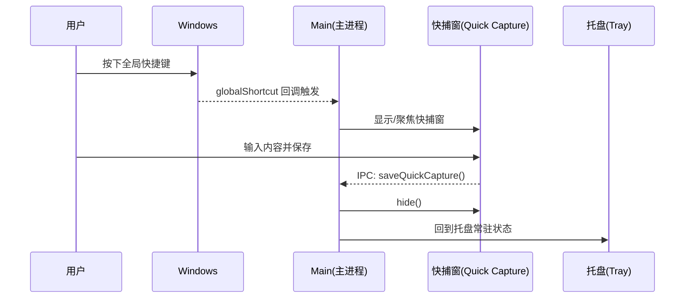
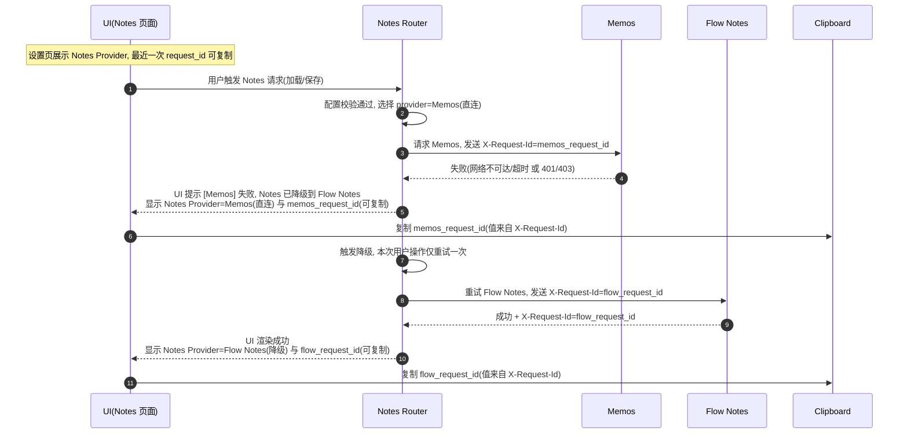
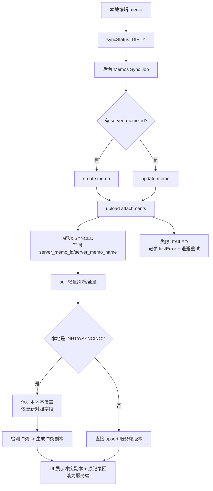
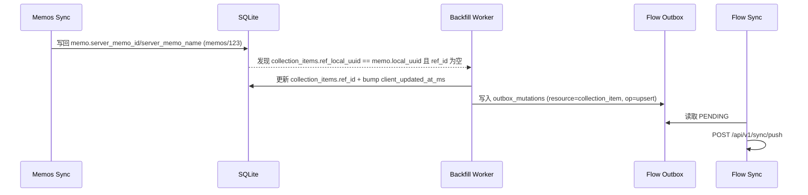

# Windows 桌面端主规格（PLAN.md）

本文档是本仓库唯一“可直接指导实现”的 Windows 桌面端主规格。

- MUST: 只承诺 Windows 10/11 桌面端。
- MUST: 桌面端不是手机端放大版, 默认键鼠与宽屏工作流。
- MUST: Triptych 三栏式是主交互, Folder/Collections 树是结构层权威入口。
- MUST: 后端边界固定为混合模式: Flow 负责 Auth/Todo/Collections/Sync, Notes 直连 Memos。

为了避免规格分裂, 本文档的口径优先级如下(冲突时执行者不得自行选择):

1) `apidocs/*` (接口字段与同步合同), 其中更具体(more specific)、更新(newer)、更贴近主题(topical)的文档优先
   - MUST: 若 `apidocs/api.zh-CN.md` 与专题合同冲突, 以专题合同为准(例如 Collections 以 `apidocs/collections.zh-CN.md` 为准)。
   - MUST: 若同一主题同时存在字段级/实体级定义与高层概述, 以字段级/实体级定义为准。
2) 本文档 `PLAN.md` (Windows 桌面端主规格, 在不改变后端合同的前提下补充 UI/流程/验收约束)
3) `.sisyphus/drafts/plan-sections/*` (仅作为编排来源, 不作为最终口径)

冲突对照表(用于执行时快速裁决, 不得自行发明第三种口径):

| 冲突项 | 权威文档 | 理由 | 兼容策略 |
|---|---|---|---|
| `sync/*` 资源枚举是否包含 `collection_item` | `apidocs/collections.zh-CN.md` | 专题同步合同比汇总枚举更具体, 且直接约束 Collections 的资源命名与 pull changes key | 客户端允许 push `resource="collection_item"` 并处理 pull `changes.collection_items`, 同时对 `apidocs/api.zh-CN.md` 枚举缺口做容错, 禁止用该枚举做硬校验 |

## 0. 已确认决策与护栏（不变量）

### 0.1 Windows-only 与窗口形态

- MUST: Windows-only。
- MUST: 主窗口默认无边框 frameless, 去掉原生标题栏。
- MUST: 点击关闭按钮默认隐藏到托盘, 不退出进程。
- MUST: 真正退出只能通过托盘右键菜单 `退出`。

### 0.2 系统能力与设置

- MUST: 托盘常驻, 托盘菜单覆盖关键路径。
- MUST: 全局快捷键可配置, 且必须处理注册失败(返回 false)的可见退路。
- MUST: 设置里可更改数据存储目录(Storage Root), 自动迁移数据, 迁移完成提示重启。

### 0.3 发布与更新

- MUST: GitHub Actions 发布 Windows installer/exe, 目标为 NSIS。
- MUST: 应用内自动检测更新, 更新过程不阻断编辑。

### 0.4 混合后端边界(硬写死)

- MUST: Flow 负责 Auth、Todo、Collections、Sync。
- MUST: Notes 直连 Memos。
- MUST: Flow 与 Memos 的 Base URL、同步状态、错误提示分离。

### 0.5 Flow 同步合同硬约束

- MUST: `client_updated_at_ms` 对同一条记录单调递增。
- MUST: tombstone 软删除使用 `deleted_at`。
- MUST: 增量拉取使用 `sync/pull` cursor。
- MUST: 变更上送使用 `sync/push`, 结果以 `applied`/`rejected` 为准。
- MUST: 冲突证据来自 `server_snapshot` 或 `rejected[].server`。
- MUST: Collections 同步资源名为 `collection_item`。
- MUST: Collections pull changes key 为 `collection_items`。

### 0.6 Memos 标识符与编码

- MUST: `memoName`/`name` 可能形如 `memos/123`(包含 `/`)。
- MUST: 任意把 `memoName` 放进路由、URL path、文件名、KV key 的地方都必须遵循 encode/decode 规则, 禁止当路径片段。

### 0.7 自定义协议安全边界

- MUST: 自定义协议 `memo-res://` 只允许读取白名单目录。
- MUST: 防穿越, 拒绝 symlink 与 Windows reparse point。
- MUST: MIME 白名单, 高风险类型强制下载。

## 1.1 概述

### 1.1.1 背景与定位

本项目的桌面端是离线优先的个人知识与结构管理工具:

- Notes(正文与附件)以 Memos 为内容权威源, 客户端直连。
- 结构与任务(文件夹树/引用/待办)以 Flow Backend 为合同源, 客户端以本地 SQLite 为权威读写, 再通过同步协议最终一致。

### 1.1.2 目标(Goals)

- MUST: 冷启动优先展示本地首屏, 不等待网络。
- MUST: 断网可用: 新建/编辑/删除/拖拽整理均可先落本地, 联网后自动同步。
- MUST: 桌面化能力完整: 托盘常驻、关闭到托盘、全局快捷键快捕、右键菜单、拖拽整理。
- MUST: 冲突可见、可恢复、不可丢用户文本。

### 1.1.3 非目标(Non-Goals)

- MUST NOT: 承诺 macOS/Linux 兼容与打包。
- MUST NOT: renderer 直接获得 Node、SQLite、任意文件路径读写权限。
- MUST NOT: 把 Notes 全量迁移到 Flow 作为一期目标。

### 1.1.4 平台与范围约束

- MUST: 本文档只描述 Windows 行为与验收。
- SHOULD: UI 视觉可参考旧草案的“毛玻璃材质 + 国风质感”方向, 但不得以视觉为由破坏性能与安全约束。

### 1.1.5 技术栈建议(迁入旧草案, 仅作为 SHOULD)

- SHOULD: Electron + React + TypeScript。
- SHOULD: 状态管理 Zustand。
- SHOULD: 拖拽 dnd-kit。
- SHOULD: 本地数据库 SQLite + better-sqlite3(主进程)。
- SHOULD: 动画 Framer Motion(用于复杂编排, 不作为合同)。

## 1.2 信息架构与导航(IA/导航)

### 1.2.1 Triptych 三栏布局基线

Triptych 三栏在所有主视图中保持一致:

- 左栏: Folder/Collections 树 + 全局入口(收件箱、回收站、Todo、设置、冲突、同步状态摘要)。
- 中栏: 当前上下文列表(时间线/收件箱/搜索结果/某 Folder 下列表/回收站列表)。
- 右栏: 详情/编辑/分享导出/冲突对比/工作区网格。

降级规则:

- SHOULD: 窗口宽度不足时可降级为双栏(左栏抽屉 + 中右合并), 但不改变核心信息架构。

### 1.2.2 Folder 树 IA(主前提)

- MUST: Folder 树是结构层权威视图。
- MUST: 节点是 `folder` 与 `note_ref` 混排模型, 支持无限层级。
- SHOULD: Root 固定入口:
  - `收件箱(Inbox)`
  - `回收站`

### 1.2.3 导航模型(主视图集合)

- MUST: 收件箱/时间线(Notes)
- MUST: Folder/Collections(结构)
- MUST: Todo
- MUST: 设置
- MUST: 冲突(聚合入口, 不要求全屏页)

### 1.2.4 拖拽与多选约束(迁入旧草案, 强制)

- MUST: 禁止把父文件夹移动到其子孙节点下, 防止形成环。
- SHOULD: 悬停展开(Hover to Open) 800ms 自动展开 Folder。
- SHOULD: 边缘滚动(Edge scrolling) 允许拖入长列表与深层树。

### 1.2.5 关键用户旅程(UX Flows, Triptych 一等公民)

以下流程必须覆盖入口、操作、状态反馈、异常分支。

1) 快速捕捉(快捕窗)

- 入口: 全局快捷键(可配置) + 托盘菜单 `快速捕捉` + 应用内按钮(兜底)。
- 操作: Enter 保存并隐藏回托盘, Esc 取消隐藏。
- 反馈: `已保存到本地` 与 `同步中/失败` 的细粒度状态。
- 异常: 快捷键注册失败必须在设置中可见并引导改键, 托盘入口仍可用。

2) 全局搜索

- 入口: 主窗口搜索框 + 全局快捷键(打开主窗并聚焦搜索框)。
- 操作: 中栏展示结果, 右栏展示详情并支持 `定位到 Folder`。
- 异常: 索引不可用需提示重建并降级, 不阻断使用。

3) 拖拽整理

- 源: 中栏列表项。
- 目标: 左栏 Folder 树节点, 以及右栏工作区网格(如该视图存在)。
- 必须: 禁止拖入子孙, hover 800ms 展开, edge scrolling。
- 反馈: 乐观更新, 且可短时 `撤销`。

4) 删除与恢复

- 删除默认软删除, 进入回收站。
- 回收站内允许恢复与彻底删除。
- 彻底删除必须二次确认。

5) 分享与导出

- 右栏提供 `分享/导出` 面板。
- 导出路径必须走系统保存对话框授权。
- 失败必须提供复制文本兜底。

6) 冲突处理

- Flow: `rejected`/`server_snapshot` 可查看, 提供保守恢复与高级强制覆盖。
- Memos: 生成冲突副本保留本地文本, 原记录回滚为服务端版本。

## 1.3 窗口与系统集成(Windows)

本章是 Windows-only 的可验收规格。所有系统能力必须由 main 进程裁决, renderer 只能通过 preload 暴露的用例级 API 触发。

### 1.3.1 无边框窗口(frameless)与可拖拽区域

- MUST: 主窗口 `frame: false`。
- MUST: 明确划分 drag 与 no-drag 区域。
- MUST: drag 区域内的按钮、输入框、可拖拽卡片必须 no-drag。

### 1.3.2 托盘常驻与关闭语义

- MUST: 托盘由 main 创建并持有强引用, 防止被 GC 回收。
- MUST: Windows 托盘图标资源使用 `.ico`。
- MUST: Win11 存在托盘溢出区, 不承诺图标永远可见, 关键能力必须有应用内入口兜底。
- MUST: 点击关闭按钮默认隐藏到托盘。
- MUST: 唯一退出路径为托盘菜单 `退出`。
- MUST: 首次点击关闭必须提示一次说明, 设置里可改关闭行为。

托盘菜单最小集合:

- MUST: 显示主窗口/隐藏主窗口(动态切换)
- MUST: 快速捕捉
- MUST: 立即同步: 笔记(Memos)
- MUST: 立即同步: 结构与待办(Flow)
- MUST: 打开设置
- MUST: 退出

退出清理:

- MUST: 退出时注销所有全局快捷键。
- MUST: 退出时停止后台同步与定时器。
- MUST: 退出时安全关闭 SQLite 连接与文件句柄。

### 1.3.3 全局快捷键(GlobalShortcut)

- MUST: 仅由 main 注册与管理。
- MUST: 仅在 app ready 后注册。
- MUST: 注册失败以返回值 false 判定, 必须在设置页显式提示并引导改键。
- MUST: 设置页支持修改/禁用/恢复默认。
- MUST: 应用退出(will-quit)必须注销所有全局快捷键。

### 1.3.4 数据目录选择与迁移(Storage Root)

- MUST: 设置页提供“数据存储目录”与“更改目录”。
- MUST: 更改目录后自动迁移至少包含:
  - SQLite DB
  - SQLite WAL/SHM(如存在)
  - attachments-cache
  - logs
- MUST: 迁移失败可回滚, 旧目录仍可用。
- MUST: 迁移完成提示重启, 并提供立即重启入口。

### 1.3.5 右键菜单

- MUST: 自定义右键菜单至少覆盖:
  - 中栏条目: 打开、移动到、删除、导出
  - 左栏 Folder: 新建子项、重命名、移动、删除

### 1.3.6 关键时序(mermaid)



## 1.4 后端与网络边界(混合后端)

### 1.4.1 责任划分(必须写死)

| 领域 | 权威源 | 客户端链路 | 备注 |
|---|---|---|---|
| Auth | Flow Backend | Flow | 登录返回 token + server_url(默认 Memos Base); token 是否可用于直连 Memos 取决于配置/集成状态, 不得假设永远可用 |
| Todo | Flow Backend | Flow | 在线接口 + sync/pull, sync/push 离线一致 |
| Collections | Flow Backend | Flow | sync 资源为 collection_item |
| Sync | Flow Backend | Flow | applied/rejected 与 cursor 合同 |
| Notes | Memos | 直连 Memos | memoName/name 可能为 memos/123 |

#### 1.4.1.1 Source-of-Truth（SoT）与“禁止隐式双写”护栏

本节定义每个领域的 Source-of-Truth（SoT，事实来源/权威源）以及可执行的读写路径护栏，用于阻止实现者在混合后端下出现“看似更稳”的隐式双写。

硬规则(必须遵守, 违反即数据一致性缺陷):

- MUST: 每次用户操作(一次点击/一次保存/一次批量动作)对同一领域对象只允许选择一个最终写入落点(一个 SoT)。
- MUST: 默认只写入一个 provider（Memos 或 Flow Notes）。Notes 的 provider 由 Notes 路由决策树裁决, 单次请求只允许一个最终落点。
- MUST NOT: 禁止隐式双写(silent dual-write/dual-write)。不得在无用户显式意图与无可见证据的情况下, 同时写入 Memos 与 Flow Notes 的同一份 Notes 正文/附件引用。
- MUST NOT: 禁止“写 A 成功后后台偷偷补写 B”或“写 A 失败后偷偷补写 B 并对用户伪装成 A 成功”的策略。
- 允许的例外(必须可见且可审计):
  - MUST: 显式迁移/修复动作(例如用户点击“迁移到 Memos/修复到 Flow Notes”)才允许发生跨 provider 的二次写入, 且 UI 必须展示来源/目标/数量/失败项与可复制 `request_id`。
  - MUST: 跨领域联动(例如 Notes 获得服务端标识后回填 Collections 引用到 Flow outbox)不属于双写, 但写入仍必须遵守各自领域的 SoT 与写路径。

Ownership Matrix（可执行规则: 领域 -> 权威源(SoT) -> 允许的读路径/写路径）:

| 领域 | 权威源(SoT) | 允许读路径 | 允许写路径 |
|---|---|---|---|
| Notes(正文) | Notes Router 选定的 provider(默认 Memos; 降级时 Flow Notes) | 读优先本地 SQLite 镜像/缓存; 需要刷新时从本次选定 provider 拉取并回填 SQLite | 写必须先落本地 SQLite(草稿/待同步/回滚证据)并产生可追踪变更; 后台仅向本次选定 provider 写入一次作为最终落点 |
| Notes(附件) | 附件原件: 本地 Storage Root `attachments/`; 附件引用绑定到 Notes Router 选定 provider | 读从 `attachments/` 原件或 `attachments-cache/` 缓存; 若缺失则显式下载任务写入 cache(不得在协议层偷偷下载) | 写先把原件落 `attachments/`(原子写); 再仅向本次选定 provider 上传并绑定到该 provider 的 Notes(不得两边都绑) |
| Todo | 本地 SQLite(离线权威) + Flow Sync(最终一致) | UI 只读 SQLite; sync/pull 回填 SQLite 作为最新可见状态 | UI 写 SQLite + 同一事务写入 `outbox_mutations`; 仅通过 Flow sync/push 上送, 不直写远端状态表 |
| Collections | 本地 SQLite(离线权威) + Flow Sync(最终一致) | UI 只读 SQLite; sync/pull 回填, Backfill 只读/回填引用 | UI 写 SQLite + 同一事务写入 `outbox_mutations(resource=collection_item, ...)`; 仅通过 Flow sync/push 上送 |
| UserSettings | 本地设置存储(例如 SQLite `user_settings` 或等价持久化), 与 token/远端解耦 | renderer 通过 IPC 读取; main 进程从本地设置存储读取并返回 | renderer 通过 IPC 发起写入; main 进程写本地设置存储(不得把设置塞进 Flow/Memos 作为影子副本) |

冲突策略(保守, 不静默覆盖用户文本):

- MUST: 任意冲突(在线 409、同步 rejected conflict、并发写入)都必须保留本地副本与服务端快照证据, 不得静默覆盖或丢弃用户文本。
- MUST: Notes 冲突采用“冲突副本”策略: 保留本地正文为冲突副本(含时间戳与 `request_id`), 原记录回滚为服务端版本; UI 必须可对比与一键复制。
- MUST: 对于曾经降级写入 Flow Notes 的 Notes, 在 Memos 恢复可用后不得自动把同一内容迁移/补写到 Memos(避免隐式双写与语义漂移)。若需要统一落点, 只能走显式迁移动作。

#### 1.4.1.2 Notes 路由决策树(混合 + 可降级 fallback / Decision Tree)

目标: 默认不走 Flow Notes, Notes 以直连 Memos 为主链路; 只有在严格触发条件下, 单次请求可降级到 Flow Notes 作为可用性兜底。

硬规则(可执行, 必须按顺序裁决):

1) 配置校验(触发条件 -> 选择结果 -> 用户可见反馈)
   - 触发条件: `memosBaseUrl` 缺失/空字符串, 或标准化后仍不合法(无法解析为 URL, 或 scheme 非 http/https)。
   - 选择结果: MUST: 本次 Notes 请求走 Flow Notes(降级), 且 MUST NOT 继续尝试直连 Memos。
   - 用户可见反馈:
     - MUST: 设置页展示 `Notes Provider = Flow Notes(降级)` 并显示原因 `memos_base_url_invalid`。
     - MUST: Notes 相关错误提示标注来源 `[FlowNotes]` 并展示可复制 `request_id`。

2) 默认路径(主链路)
   - 触发条件: 通过(1) 配置校验。
   - 选择结果: MUST: 本次 Notes 请求先直连 Memos。
   - 用户可见反馈:
     - MUST: 设置页展示 `Notes Provider = Memos(直连)`。

3) Memos 鉴权/权限失败降级
   - 触发条件: 直连 Memos 返回 HTTP 401 或 403。
   - 选择结果: MUST: 本次请求立即降级到 Flow Notes 重试一次(同一用户操作内不得双写; 仅选择其一作为最终落点)。
   - 用户可见反馈:
     - MUST: UI 必须明确提示“`[Memos] 401/403, Notes 已降级到 Flow Notes`”, 并提示用户可行动作: 重新登录/检查 token。
     - MUST: 错误详情中同时区分来源 `[Memos]` 与 `[FlowNotes]`, 并展示可复制 `request_id`。

4) Memos 网络不可达/超时降级
   - 触发条件: 直连 Memos 发生网络层失败或超时(例如 DNS 失败、连接被拒绝、TLS 握手失败、无响应超时), 即请求在获得有效 HTTP 响应前失败。
   - 选择结果: MUST: 本次请求降级到 Flow Notes 重试一次。
   - 用户可见反馈:
     - MUST: UI 必须明确提示“`[Memos] 网络不可达/超时, Notes 已降级到 Flow Notes`”。
     - MUST: 错误详情标注来源并提供可复制 `request_id`。

5) 非降级错误(避免掩盖真实故障)
   - 触发条件: 直连 Memos 已返回有效 HTTP 响应, 且状态码不是 401/403(例如 400/404/409/429/5xx 等)。
   - 选择结果: MUST: 不得自动降级到 Flow Notes(避免把 Memos 的真实错误掩盖为“可用性问题”), 直接向用户暴露该错误。
   - 用户可见反馈:
     - MUST: 错误提示标注来源 `[Memos]`, 并展示可复制 `request_id`。

可观测性与 request_id 规则(Notes 专用, 硬写死):

- MUST: Notes 的每次请求都生成 `request_id`(UUID 或等价随机标识)并随请求发送 `X-Request-Id`。
- MUST: 若服务端错误体或响应头携带 `request_id`, UI 以服务端 `request_id` 为准; 否则展示客户端生成的 `request_id`。
- MUST: 若一次用户操作内发生“直连 Memos 失败 -> 降级到 Flow Notes 重试”, UI/日志必须分别记录并展示两条 request_id, 且至少区分来源(Flow 与 Memos 的 request_id 不得混用; 允许展示为 `memos_request_id`/`flow_request_id` 或 `request_id + source`)。
- MUST: 设置页在“后端/网络”区域展示当前 Notes Provider(直连/降级)、最近一次降级原因(若有)、最近一次 Notes 请求的 `request_id`(可复制)。

补充: Notes 降级路径关键时序(用户操作内一次降级重试):



### 1.4.2 Base URL 与标准化

- Flow Base URL 默认 `https://xl.pscly.cc`。
- MUST: Flow 与 Memos Base URL 都要标准化: 去尾部 `/` 并确保 scheme。
- SHOULD: Memos Base URL 默认来自登录返回 `server_url`, 允许用户覆盖。

### 1.4.3 鉴权与请求头

- MUST: Flow 调用使用 `Authorization: Bearer <token>`。
- SHOULD: 直连 Memos 若需要鉴权, 可尝试使用 `Authorization: Bearer <token>`。
- MUST: 不得假设 Flow token 永远可用于 Memos(其有效性取决于部署配置/集成状态; 参见 `apidocs/to_app_plan.md` 对“取决于配置”的说明), 直连失败由 Notes 路由决策树触发降级策略。
- MUST: token 不写入日志, 不在 UI 明文展示。
- SHOULD: 每个请求携带 `X-Request-Id`。
- SHOULD: Flow 请求携带设备头用于排障与设备识别:
  - `X-Flow-Device-Id: <stable-device-id>`
  - `X-Flow-Device-Name: <human-readable-device-name>`
- MUST: token 持久化使用 Windows Credential Vault 或 DPAPI 等安全存储, 不落明文文件/SQLite。

## 1.5 数据模型(本地 + 远端)

### 1.5.1 本地持久化总览(SQLite)

- MUST: 本地 SQLite 是离线权威源。
- MUST: SQLite 连接只在 main 进程, renderer 禁直连。
- MUST: 写入必须事务化: 业务表写入 + outbox_mutations(如需要) 同一事务提交。

### 1.5.2 Storage Root 目录布局(必须可迁移)

所有路径保存为相对 `<root>` 的 relpath, 迁移仅切换根目录。

- `<root>/db/` (SQLite 主库 + WAL/SHM)
- `<root>/attachments/` (用户原件, 不参与缓存 GC)
- `<root>/attachments-cache/` (缓存, 受配额与 LRU/GC)
- `<root>/logs/` (脱敏日志)
- `<root>/tmp/` (原子写临时目录)
- `<root>/exports/` (导出文件)

### 1.5.3 核心表与关键字段(最小完整集)

- MUST: `outbox_mutations` 作为离线写入队列, 字段至少包含:
  - `resource`, `op`, `entity_id`, `client_updated_at_ms`, `status`, `attempt`, `next_retry_at_ms`
- MUST: `sync_state` 持久化 Flow cursor。
- SHOULD: `jobs` 持久化后台任务去重与恢复。
- SHOULD: 搜索使用 FTS5, 避免 IPC 查询风暴。
- MUST: Flow 侧至少落库并支持 tombstone `deleted_at`: `todo_lists`, `todo_items`, `todo_occurrences`, `collection_items`, `user_settings`。
- MUST: `notes` 仅作为 Flow Notes provider 的降级承载(离线镜像/派生缓存): 仅当 Notes Router 单次请求选择 `Flow Notes(降级)` 时, 才允许读写与同步该表, 且必须支持 tombstone `deleted_at`。该表不代表 Flow 是 Notes 的权威源, 也不代表默认路径走 Flow。
- MUST NOT: 任何实现者不得把 Flow `resource=note` 的 sync 当成默认路径或后台常驻同步, 除非降级触发且本次请求 provider 已裁决为 `Flow Notes(降级)`。
- MUST: Memos 侧至少落库: `memos`(含 `server_memo_id` 与 `server_memo_name`), `memo_attachments`(含 `local_relpath` 与 `cache_relpath`)。

### 1.5.4 Notes(Memos) 的标识符约束

- MUST: Memo 的 `memoName`/`name` 可能为 `memos/123`。
- MUST NOT: 把 `memoName` 当作文件名、路径片段、或路由的原始 segment。

#### 1.5.4.1 encode/decode 规则(必须明确)

目标: `memoName` 在存储与导航中必须 round-trip。

- MUST: 任何把 `memoName` 放进路由参数的地方必须 encode, 页面入口必须 decode。
- MUST: 任何把 `memoName` 作为本地 key 的地方必须使用稳定编码, 禁止直接当文件名。

推荐口径(实现可等价, 但必须满足语义):

- 路由与 URL 参数:
  - encode: `encodeURIComponent(memoName)`
  - decode: `decodeURIComponent(encoded)`
- 本地 key(建议 base64url):
  - encode: `base64url(utf8(memoName))`
  - decode: `utf8(base64url_decode(key))`

### 1.5.5 Collections(结构层) 的同步资源名

- MUST: 结构层实体为 `collection_item`。
- MUST: pull changes key 为 `collection_items`。
- MUST: `collection_item.item_type` 仅允许 `folder` 与 `note_ref`。

### 1.5.6 附件与离线资源(本地缓存合同)

目标: renderer 永远不拿到真实磁盘路径, 附件离线可预览且可回收。

- MUST: 附件引用分三类, 互不混用:
  - 本地原件: `local_relpath`(位于 `<root>/attachments/`, 不参与缓存 GC)
  - 缓存文件: `cache_relpath`(位于 `<root>/attachments-cache/`, 受配额与 LRU/GC)
  - 远端引用: 仅用于再下载, 禁止当文件名或路径片段
- MUST: 自定义协议是唯一预览入口: `memo-res://<cacheKey>`。
- MUST: `cacheKey` 是不透明标识, 禁止直接塞入任意 relpath。
- MUST: `memo-res://` 协议层只做读取路由, 不允许协议层偷偷触发网络下载。
- SHOULD: 缓存配额字段 `attachmentCacheMaxMb`, 超限按 LRU 驱逐, 不阻断编辑。

## 1.6 同步与冲突(Sync + LWW)

本章包含两条主干: Flow Sync 与 Memos Sync。两者的状态与错误不得混用。

### 1.6.1 Flow Sync: 模型与协议边界

#### 1.6.1.1 outbox 生成规则

- MUST: 任意改变本地可见状态的写操作, 必须同一事务写入业务表与 outbox。
- MUST: delete 操作必须生成 `op="delete"` 的 outbox 条目, 不能因为本地已 tombstone 就跳过。

#### 1.6.1.2 `client_updated_at_ms` 单调递增

- MUST: 对同一实体 id, 新写入取 `max(now_ms, last_ms + 1)`。
- MUST: 自动写入(例如 backfill)也必须 bump。

#### 1.6.1.3 sync/push

- MUST: `sync/push` 的成功标准是逐条处理 `applied` 与 `rejected`, 不能以 HTTP 200 判断。
- SHOULD: 推送批量大小建议 50 至 200, 默认 100。
- MUST: 429 `rate_limited` 必须遵守 `Retry-After` 并暂停本轮剩余 push, 防止雪崩。
- SHOULD: 网络错误与 5xx 采用指数退避 + 抖动, 且重试上限有限。
- MUST: 401 `unauthorized` 视为不可自动恢复, 停止自动重试并引导重新登录。
- MUST: `rejected` 分类:
  - `reason="conflict"`: 保存 `rejected[].server`, 标记冲突待处理。
  - 语义校验类: 标记不可自动重试, 暴露到 UI。
  - 未知 reason: 保守可重试, 记录日志。

#### 1.6.1.4 sync/pull

- MUST: `sync/pull` 使用 cursor 增量拉取。
- MUST: apply changes 成功落库后才能推进 cursor 到 next_cursor。
- MUST: 响应 `has_more=true` 时必须循环拉取并 apply, 直到 `has_more=false` 为止, 禁止只拉取一页就结束。
- MUST: 循环拉取时 cursor 必须严格使用上一轮响应的 `next_cursor` 作为下一次请求参数; 任一轮 apply 落库失败必须停止并保持旧 cursor 不变。
- MUST: `deleted_at != null` 的对象按 tombstone 应用。
- MUST: 对未知 `changes` key 容错, 忽略并记录日志。

#### 1.6.1.5 Collections 合同漂移容错原则

已知漂移: `apidocs/api.zh-CN.md` 的 sync 资源枚举未列出 `collection_item`, 但 `apidocs/collections.zh-CN.md` 的 Collections 合同明确支持并以其为准。

- MUST: 以 Collections 合同为准, push 允许 `resource="collection_item"`。
- MUST: pull 显式处理 `changes.collection_items`。
- SHOULD: 若后端出现别名 key(大小写或下划线差异), 客户端可做兼容映射, 但必须记录日志事件用于排障。

### 1.6.2 Memos Sync: 状态机与冲突副本

- MUST: 本地编辑优先, 回拉永远不覆盖本地未同步编辑。
- MUST: 冲突时生成冲突副本保留本地文本, 原记录回滚为服务端版本。
- MUST: memo 同步状态机至少包含:
  - `LOCAL_ONLY`, `DIRTY`, `SYNCING`, `SYNCED`, `FAILED`
- SHOULD: 附件同步顺序: 先上传附件拿到远端引用, 再绑定到 memo, 避免引用错乱。

### 1.6.3 Backfill 联动(Collections 引用回填)

当 memo 同步成功获得服务端标识后, 必须回填结构层引用:

- 触发: memo 写回 `server_memo_id` 或 `server_memo_name`(例如 `memos/123`)。
- 动作: 更新对应 `collection_item` 的 `ref_id`, 并 bump `client_updated_at_ms`。
- MUST: 回填写入必须进入 Flow outbox, 以便后续 `sync/push`。

### 1.6.4 Mermaid: 核心数据流(至少 3 段)

```mermaid
flowchart LR
  UI[UI 写入本地表] --> TX[(同一事务\n业务表 + outbox_mutations)]
  TX --> OB[outbox: flow/PENDING]
  OB --> PUSH[POST /api/v1/sync/push\nmutations[]]
  PUSH -->|applied[]| A[标记 APPLIED / 删除 outbox]
  PUSH -->|rejected[]| R[标记 REJECTED_*\n保存 server 快照]
  A --> PULL[GET /api/v1/sync/pull\ncursor -> next_cursor]
  R --> PULL
  PULL --> APPLY[apply changes\nupsert + tombstone]
  APPLY --> UI2[UI 订阅本地 SQLite]
```





## 1.7 安全模型(Electron)

### 1.7.1 Electron 安全基线

- MUST: `contextIsolation: true`。
- MUST: `nodeIntegration: false`。
- MUST: `webSecurity: true`。
- MUST: `allowRunningInsecureContent: false`。
- MUST: renderer 不直接接触 SQLite/文件系统写入/系统凭据库。
- MUST: preload 只暴露用例级 API, 禁止暴露通用 ipcRenderer。
- MUST: 禁止任意导航, 对 `will-navigate` 默认 `preventDefault()`。
- MUST: 拦截 `window.open`, 默认 deny, 仅允许受控外链打开策略。

### 1.7.2 IPC 白名单与参数校验

- MUST: IPC 命名空间静态可枚举, main 侧逐一 handle, 禁止通配。
- MUST: 每个 IPC 参数校验与限流, 防 DoS。
- MUST: 返回统一错误结构, 禁止把内部异常堆栈与绝对路径透传给 renderer。

### 1.7.3 路径权限门

- MUST: 导出路径只能来自系统保存对话框授权。
- MUST: 导入路径只能来自系统打开对话框授权(或等价的二次确认)。
- MUST NOT: renderer 通过 IPC 传入任意绝对路径让 main 读写。

### 1.7.4 自定义协议 `memo-res://` 安全边界(强制)

- MUST: 白名单目录仅 `<root>/attachments-cache/` 与 `<root>/attachments/`。
- MUST: 防穿越: 拒绝任何分隔符与编码绕过。
- MUST: 拒绝 symlink 与 Windows reparse point。
- MUST: MIME 白名单。
- MUST: 高风险可执行类型强制下载(`Content-Disposition: attachment`), 禁止内联预览。

## 1.8 错误处理与可观测性

### 1.8.1 错误分类(统一口径)

- 网络/离线
- 鉴权与权限(401/403)
- 并发冲突(409 或 sync rejected conflict)
- 限流(429 + Retry-After)
- 超限(413 payload_too_large)
- 上游错误(502 upstream_error)
- 本地 I/O(磁盘满、DB 损坏、不可写)

### 1.8.2 冲突证据必须可见

- MUST: 在线 409 冲突读取并持久化 `server_snapshot`。
- MUST: 同步冲突读取并持久化 `rejected[].server`。
- MUST: UI 至少提供:
  - 查看快照
  - 应用服务端版本(保守模式默认)
  - 保留本地副本
  - 强制覆盖(高级, 二次确认)

### 1.8.3 request id 与日志

- MUST: 所有请求发送 `X-Request-Id`。
- MUST: 诊断面板支持复制 request_id。
- MUST: 日志存放在 `<root>/logs/`, 且脱敏, 禁止包含 token、Authorization、绝对路径。

### 1.8.4 后端错误合同(ErrorResponse)最小形状

- MUST: 非 2xx 优先解析 JSON 的 `error`, `message`, `request_id`, `details`。
- MUST: 409 冲突时 `details.server_snapshot` 作为恢复证据。

示例:

```json
{
  "error": "conflict",
  "message": "conflict",
  "request_id": "...",
  "details": {
    "server_snapshot": {"id": "..."}
  }
}
```

### 1.8.5 413 payload_too_large 处理策略

- MUST: 检测到 HTTP 413 或 ErrorResponse `error=="payload_too_large"` 时, 立即停止自动重试(不可盲重试), 并在 UI 明确提示“请求体过大/超出上限”。
- MUST: 诊断面板与日志必须记录 `request_id` 与 `error` code(例如 `payload_too_large`), 但 MUST NOT 记录 token、Authorization、文件名、绝对路径。
- MUST: 附件上传场景触发 413/payload_too_large 时, 必须提供用户可行动作:
  - 压缩/降低分辨率后重试
  - 改用外链(仅保存链接)
  - 仅保存文本/去除附件后保存
  - 打开设置/帮助查看当前附件或请求体上限(如后端提供)
- SHOULD: Flow `sync/push` 场景触发 payload_too_large(请求体过大)时, 客户端允许自动降低 batch size、拆分 mutations 分批推送; 但 MUST: 不得丢失本地变更, 拆分仅改变传输批次不改变语义。

## 1.9 性能预算

### 1.9.1 首屏与列表

- SHOULD: 冷启动到 Triptych 可交互 p95 <= 1200ms。
- MUST: 大列表使用虚拟列表, 禁止一次性渲染全量。

### 1.9.2 IPC 查询风暴防线(迁入旧草案, 强制)

- MUST: 禁止 renderer 先拿 id 列表再逐条 IPC 拉详情。
- MUST: 列表/搜索 IPC 必须一次返回一页窗口 + 必要字段。
- SHOULD: 采用 CQRS 分离读写, 配合乐观更新提升拖拽与移动体验。

### 1.9.3 拖拽性能约束

- SHOULD: drag overlay 出现 p95 <= 16ms。
- SHOULD: hover 800ms 展开后渲染 p95 <= 120ms。

### 1.9.4 同步与附件的后台资源边界

- SHOULD: 同步后台平均 CPU% <= 15%, 峰值 <= 35%(短时)。
- SHOULD: 附件预览首帧(缓存命中) p95 <= 200ms。

## 1.10 安装与更新

### 1.10.1 发布形态

- MUST: GitHub Actions 在 Windows runner 构建并发布。
- MUST: 产物以 NSIS 安装包为主。
- MUST: Windows 自动更新使用 NSIS 目标的更新链路, 不采用不受支持的更新目标。
- MUST: Release 附带 SHA-256 校验文件。
- MUST: 密钥与签名材料不入库, 仅通过 CI secrets 注入。
- MUST: `appId` 必须稳定(用于 Windows 通知归属与更新提示一致性), 变更需要作为破坏性变更评审。

### 1.10.2 应用内自动检测更新

- MUST: 启动后进行一次轻量检查, 且设置页可手动检查。
- MUST: 下载在后台进行, 不抢焦点、不阻断编辑。
- MUST: 下载完成后由用户触发安装更新, 支持延后。
- MUST: 校验失败或安装失败时保持当前版本可用, 并提供重试与打开 Releases 的退路。

## 1.11 验收清单(可复制执行)

以下清单用于对最终 `PLAN.md` 做自动化 PASS/FAIL 核对。注意: 本清单本身也必须满足“文档不可出现悬空占位词”的要求, 因此相关检测模式在脚本中运行时拼接生成。

### 1.11.1 章节覆盖检查(结构完整性)

PASS 判定: 下列关键词在 `PLAN.md` 中至少命中 1 行。

```bash
set -euo pipefail

PLAN_FILE="PLAN.md"

required_sections=(
  "目标" "非目标"
  "信息架构" "IA" "导航"
  "窗口" "系统集成"
  "数据模型" "SQLite"
  "同步" "冲突"
  "Electron" "安全"
  "错误处理"
  "性能预算"
  "安装" "更新"
  "验收" "清单"
)

missing=0
for kw in "${required_sections[@]}"; do
  if ! rg -n --fixed-strings "$kw" "$PLAN_FILE" >/dev/null; then
    echo "[FAIL] 缺少章节/关键词: $kw"
    missing=$((missing + 1))
  else
    echo "[PASS] $kw"
  fi
done

test "$missing" -eq 0
echo "[PASS] 章节覆盖检查: missing=$missing"
```

### 1.11.2 Flow 合同关键字检查

PASS 判定: 关键字全部出现, 且在文档中被解释。

必查关键字:

- `client_updated_at_ms`
- `deleted_at`
- `sync/pull`
- `sync/push`
- `applied`
- `rejected`
- `server_snapshot`
- `collection_item`

```bash
set -euo pipefail

PLAN_FILE="PLAN.md"

flow_contract_keywords=(
  "client_updated_at_ms"
  "deleted_at"
  "sync/pull"
  "sync/push"
  "applied"
  "rejected"
  "server_snapshot"
  "collection_item"
)

missing=0
for kw in "${flow_contract_keywords[@]}"; do
  hits=$(rg -n --fixed-strings "$kw" "$PLAN_FILE" | wc -l | tr -d ' ')
  if [ "$hits" -lt 1 ]; then
    echo "[FAIL] Flow 合同关键字缺失: $kw"
    missing=$((missing + 1))
  else
    echo "[PASS] $kw (hits=$hits)"
  fi
done

test "$missing" -eq 0
echo "[PASS] Flow 合同关键字检查: missing=$missing"
```

### 1.11.3 Memos 关键字检查(Notes 直连 + ID 编码约束)

PASS 判定: `memos/`、`memoName`、`encode`、`decode` 都可检索到。

```bash
set -euo pipefail

PLAN_FILE="PLAN.md"

memos_keywords=("memos/" "memoName")
missing=0
for kw in "${memos_keywords[@]}"; do
  hits=$(rg -n --fixed-strings "$kw" "$PLAN_FILE" | wc -l | tr -d ' ')
  if [ "$hits" -lt 1 ]; then
    echo "[FAIL] Memos 关键字缺失: $kw"
    missing=$((missing + 1))
  else
    echo "[PASS] $kw (hits=$hits)"
  fi
done

enc_hits=$(rg -n "\\bencode\\b" "$PLAN_FILE" | wc -l | tr -d ' ')
dec_hits=$(rg -n "\\bdecode\\b" "$PLAN_FILE" | wc -l | tr -d ' ')
if [ "$enc_hits" -lt 1 ] || [ "$dec_hits" -lt 1 ]; then
  echo "[FAIL] encode/decode 约束不完整: encode=$enc_hits decode=$dec_hits"
  missing=$((missing + 1))
else
  echo "[PASS] encode/decode (encode=$enc_hits decode=$dec_hits)"
fi

test "$missing" -eq 0
echo "[PASS] Memos 关键字检查: missing=$missing"
```

### 1.11.4 Mermaid 段落数量检查

PASS 判定: `PLAN.md` 中 `mermaid` 代码块数量 >= 3。

```bash
set -euo pipefail

PLAN_FILE="PLAN.md"

mermaid_blocks=$( (rg -n '^```mermaid$' "$PLAN_FILE" || true) | wc -l | tr -d ' ')
echo "mermaid_blocks=$mermaid_blocks"
test "$mermaid_blocks" -ge 3
echo "[PASS] Mermaid 段落数量检查(>=3)"
```

### 1.11.5 决策树唯一性/矛盾清零/漂移声明检查

PASS 判定: `PLAN.md` 中以下 3 类约束都至少命中 1 行(用于确保 Notes 路由决策树、SoT 护栏与 Collections 漂移声明均被明确写入验收口径)。

```bash
set -euo pipefail

PLAN_FILE="PLAN.md"

missing=0

decision_tree_pattern='(决策树|fallback|降级)'
sot_pattern='(禁止.*双写|Source-of-Truth|事实来源|权威源)'
drift_keyword='collection_item'

decision_tree_hits=$( (rg -n "$decision_tree_pattern" "$PLAN_FILE" || true) | wc -l | tr -d ' ')
if [ "$decision_tree_hits" -lt 1 ]; then
  echo "[FAIL] Notes 决策树/降级口径缺失: pattern=$decision_tree_pattern"
  missing=$((missing + 1))
else
  echo "[PASS] Notes 决策树/降级口径 (hits=$decision_tree_hits)"
fi

sot_hits=$( (rg -n "$sot_pattern" "$PLAN_FILE" || true) | wc -l | tr -d ' ')
if [ "$sot_hits" -lt 1 ]; then
  echo "[FAIL] SoT/禁止隐式双写护栏缺失: pattern=$sot_pattern"
  missing=$((missing + 1))
else
  echo "[PASS] SoT/禁止隐式双写护栏 (hits=$sot_hits)"
fi

drift_hits=$( (rg -n --fixed-strings "$drift_keyword" "$PLAN_FILE" || true) | wc -l | tr -d ' ')
if [ "$drift_hits" -lt 1 ]; then
  echo "[FAIL] Collections 漂移声明/资源名缺失: $drift_keyword"
  missing=$((missing + 1))
else
  echo "[PASS] Collections 漂移声明/资源名 $drift_keyword (hits=$drift_hits)"
fi

test "$missing" -eq 0
echo "[PASS] 决策树/SoT/漂移声明检查: missing=$missing"
```

### 1.11.6 悬空占位词清零检查

PASS 判定: `PLAN.md` 中不出现常见占位词(用于防止遗留悬空口径)。为避免验收文本自身触发命中, 该正则在运行时拼接生成。

```bash
set -euo pipefail

PLAN_FILE="PLAN.md"

pattern=$(printf "%s%s%s|%s%s|%s%s" "T" "B" "D" "待" "定" "未" "决")
hits=$( (rg -n "$pattern" "$PLAN_FILE" || true) | wc -l | tr -d ' ')
echo "placeholder_hits=$hits"
test "$hits" -eq 0
echo "[PASS] 占位词清零检查(0 行命中)"
```

### 1.11.7 一键总判定

```bash
set -euo pipefail

PLAN_FILE="PLAN.md"
fail=0

required_sections=(
  "目标" "非目标" "信息架构" "导航" "窗口" "系统集成" "数据模型" "SQLite"
  "同步" "冲突" "Electron" "安全" "错误处理" "性能预算" "安装" "更新" "验收" "清单"
)
for kw in "${required_sections[@]}"; do
  rg -n --fixed-strings "$kw" "$PLAN_FILE" >/dev/null || fail=$((fail + 1))
done

flow_contract_keywords=(
  "client_updated_at_ms" "deleted_at" "sync/pull" "sync/push"
  "applied" "rejected" "server_snapshot" "collection_item"
)
for kw in "${flow_contract_keywords[@]}"; do
  rg -n --fixed-strings "$kw" "$PLAN_FILE" >/dev/null || fail=$((fail + 1))
done

rg -n --fixed-strings "memos/" "$PLAN_FILE" >/dev/null || fail=$((fail + 1))
rg -n --fixed-strings "memoName" "$PLAN_FILE" >/dev/null || fail=$((fail + 1))
rg -n "\\bencode\\b" "$PLAN_FILE" >/dev/null || fail=$((fail + 1))
rg -n "\\bdecode\\b" "$PLAN_FILE" >/dev/null || fail=$((fail + 1))

rg -n "(决策树|fallback|降级)" "$PLAN_FILE" >/dev/null || fail=$((fail + 1))
rg -n "(禁止.*双写|Source-of-Truth|事实来源|权威源)" "$PLAN_FILE" >/dev/null || fail=$((fail + 1))
rg -n --fixed-strings "collection_item" "$PLAN_FILE" >/dev/null || fail=$((fail + 1))

mermaid_blocks=$( (rg -n '^```mermaid$' "$PLAN_FILE" || true) | wc -l | tr -d ' ')
test "$mermaid_blocks" -ge 3 || fail=$((fail + 1))

pattern=$(printf "%s%s%s|%s%s|%s%s" "T" "B" "D" "待" "定" "未" "决")
hits=$( (rg -n "$pattern" "$PLAN_FILE" || true) | wc -l | tr -d ' ')
test "$hits" -eq 0 || fail=$((fail + 1))

if [ "$fail" -eq 0 ]; then
  echo "VERDICT: PASS"
else
  echo "VERDICT: FAIL (fail_checks=$fail)"
  exit 1
fi
```
